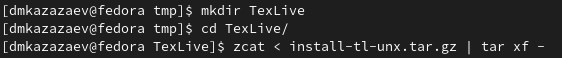
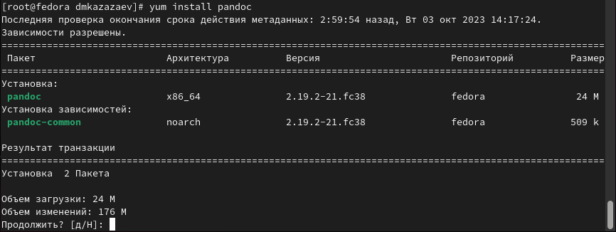
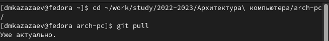
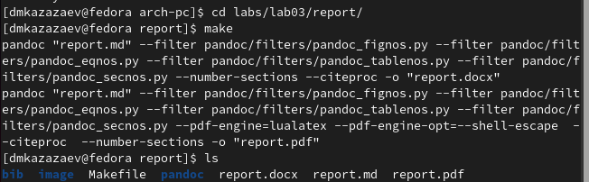
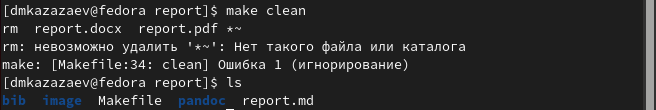
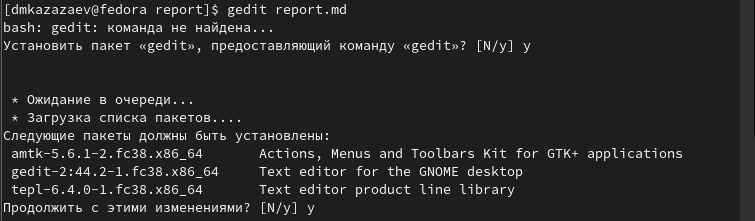
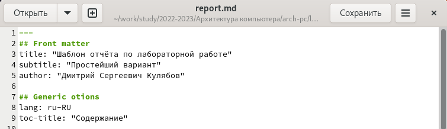
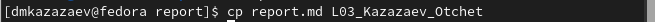
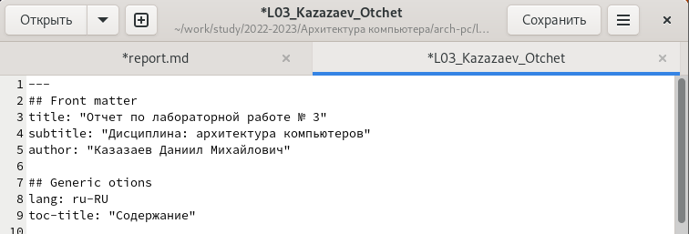
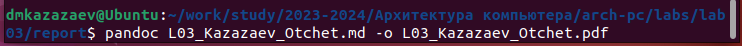

---
## Front matter
title: "Отчет по лабораторной работе № 3"
subtitle: "Дисциплина: архитектура компьютеров"
author: "Казазаев Даниил Михайлович"

## Generic otions
lang: ru-RU
toc-title: "Содержание"

## Bibliography
bibliography: bib/cite.bib
csl: pandoc/csl/gost-r-7-0-5-2008-numeric.csl

## Pdf output format
toc: true # Table of contents
toc-depth: 2
lof: true # List of figures
lot: true # List of tables
fontsize: 12pt
linestretch: 1.5
papersize: a4
documentclass: scrreprt
## I18n polyglossia
polyglossia-lang:
  name: russian
  options:
	- spelling=modern
	- babelshorthands=true
polyglossia-otherlangs:
  name: english
## I18n babel
babel-lang: russian
babel-otherlangs: english
## Fonts
mainfont: PT Serif
romanfont: PT Serif
sansfont: PT Sans
monofont: PT Mono
mainfontoptions: Ligatures=TeX
romanfontoptions: Ligatures=TeX
sansfontoptions: Ligatures=TeX,Scale=MatchLowercase
monofontoptions: Scale=MatchLowercase,Scale=0.9
## Biblatex
biblatex: true
biblio-style: "gost-numeric"
biblatexoptions:
  - parentracker=true
  - backend=biber
  - hyperref=auto
  - language=auto
  - autolang=other*
  - citestyle=gost-numeric
## Pandoc-crossref LaTeX customization
figureTitle: "Рис."
tableTitle: "Таблица"
listingTitle: "Листинг"
lofTitle: "Список иллюстраций"
lotTitle: "Список таблиц"
lolTitle: "Листинги"
## Misc options
indent: true
header-includes:
  - \usepackage{indentfirst}
  - \usepackage{float} # keep figures where there are in the text
  - \floatplacement{figure}{H} # keep figures where there are in the text
---

# Цель работы

Целью данной лабораторной работы является освоение процедуры оформления отчетов с помощью легковесного языка разметки Markdown.

# Задание

1. Утсановка необходимого ПО.
2. Выполнение заданией лабораторной работы.

# Задание самостоятельной работы

1. Заполнение отчетов прошлых лабораторных работ с помощью языка разметки Markdown.

# Выполнение лабораторной работы.

## Установка необходимого ПО.

### Установка TexLive.

Скачал и распаковал архив с официального сайта TexLive, после чего устанавливаю его с помошью команды install-tl-* с правами администратора.(рис. [-@fig:001])

{#fig:001 width=70%}

### Утсановка Pandoc.

Устанавливаю Pandoc с помощью команды yum.(рис. [-@fig:002])

{#fig:002 width=70%}

## Выполнение заданий лабораторной работы.

Открываю терминал и перехожу в необходимый каталог, после чего обновляю локальный репозиторий с помощью команлы git pull.(рис. [-@fig:003])

{#fig:003 width=70%}

Перехожу в слудующий каталог и компилирую шаблон с использованием Makefile с помошью команды make, после чего проверяю выполнение команды.(рис. [-@fig:004])

{#fig:004 width=70%}

После проверки удаляю созданные файлы report.docx и report.pdf комадой make clean.(рис. [-@fig:005])

{#fig:005 width=70%}

Устанавливаю gedit для открытия markdown файлов.(рис. [-@fig:006])

{#fig:006 width=70%}

Открываю шаблон отчета в gedit.(рис. [-@fig:007])

{#fig:007 width=70%}

Копирую шаблон, чтобы сохранить его на будущее, скопированный файл сохраняю под другим название.(рис. [-@fig:008])

{#fig:008 width=70%}

Открываю скопированный под другим названием файл и начинаю работу.(рис. [-@fig:009])

{#fig:009 width=70%}

Преобразую файл отчета из .md в .pdf

{#fig:010 width=70%}

# Вывод

В результате выполнения данной лабораторной работы я освоил процедуры оформления отчетов с помощью языка разметки Markdown.
