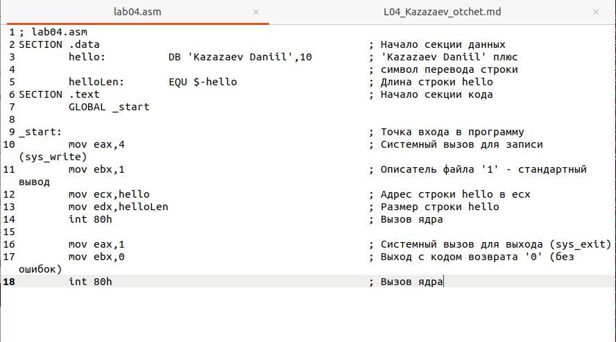

---
## Front matter
title: "Отчет по лабораторной работе № 4"
subtitle: "Дисциплина: архитектура компьютеров"
author: "Казазаев Даниил Михайлович"

## Generic otions
lang: ru-RU
toc-title: "Содержание"

## Bibliography
bibliography: bib/cite.bib
csl: pandoc/csl/gost-r-7-0-5-2008-numeric.csl

## Pdf output format
toc: true # Table of contents
toc-depth: 2
lof: true # List of figures
lot: false # List of tables
fontsize: 12pt
linestretch: 1.5
papersize: a4
documentclass: scrreprt
## I18n polyglossia
polyglossia-lang:
  name: russian
  options:
	- spelling=modern
	- babelshorthands=true
polyglossia-otherlangs:
  name: english
## I18n babel
babel-lang: russian
babel-otherlangs: english
## Fonts
mainfont: PT Serif
romanfont: PT Serif
sansfont: PT Sans
monofont: PT Mono
mainfontoptions: Ligatures=TeX
romanfontoptions: Ligatures=TeX
sansfontoptions: Ligatures=TeX,Scale=MatchLowercase
monofontoptions: Scale=MatchLowercase,Scale=0.9
## Biblatex
biblatex: true
biblio-style: "gost-numeric"
biblatexoptions:
  - parentracker=true
  - backend=biber
  - hyperref=auto
  - language=auto
  - autolang=other*
  - citestyle=gost-numeric
## Pandoc-crossref LaTeX customization
figureTitle: "Рис."
tableTitle: "Таблица"
listingTitle: "Листинг"
lofTitle: "Список иллюстраций"
lotTitle: "Список таблиц"
lolTitle: "Листинги"
## Misc options
indent: true
header-includes:
  - \usepackage{indentfirst}
  - \usepackage{float} # keep figures where there are in the text
  - \floatplacement{figure}{H} # keep figures where there are in the text
---

# Цель работы

Освоение процедуры компиляции и сборки программ, написанных на ассемблере NASM

# Задания Лабораторной работы

1. Создать текстовый фалй с именем hello.asm
2. Ввести текст программы
3. Перевести текст программы в объектный код с помощью NASM
4. Скомпилировать файл hello.asm в obj.o
5. Передать объектный файл на обработку компоновщику
6. Запустить файл

# Задания Самостоятельной работы
1. В каталоге ~/work/arch-pc/lab04 с помощью команды cp создайте копию файла
hello.asm с именем lab4.asm
2. С помощью любого текстового редактора внесите изменения в текст программы в
файле lab4.asm так, чтобы вместо Hello world! на экран выводилась строка с вашими
фамилией и именем.
3. Оттранслируйте полученный текст программы lab4.asm в объектный файл. Выполните
компоновку объектного файла и запустите получившийся исполняемый файл.
4. Скопируйте файлы hello.asm и lab4.asm в Ваш локальный репозиторий в каталог ~/work/study/2023-2024/"Архитектура компьютера"/arch-pc/labs/lab04/.
Загрузите файлы на Github.

# Выполнение лабораторной работы

Перехожу в нужную директорию для начала выполнения лабораторной работы. (рис. [-@fig:001])

{#fig:001 width=70%}

Создаю файл hello.asm. (рис. [-@fig:002])

{#fig:002 width=70%}

Открываю файл и ввожу в него текст программы. (рис. [-@fig:003])

{#fig:003 width=70%}

Устанавливаю транслятор NASM. (рис. [-@fig:004])

{#fig:004 width=70%}

Переношу файл hello.asm в объектный файл hello.o. (рис. [-@fig:005])

{#fig:005 width=70%}

Компилирую файл и создаю файл листинга list.lst. (рис. [-@fig:006])

{#fig:006 width=70%}

Передаю файл hello.o на обработку компоновщику. (рис. [-@fig:007])

{#fig:007 width=70%}

Запускаю исполняемый файл. (рис. [-@fig:008])

{#fig:008 width=70%}

Листинг программы hello:

```
     1                                  ; hello.asm
     2                                  SECTION .data					; Начало секции данных
     3 00000000 48656C6C6F20776F72-     	hello:		DB 'Hello world!',10 	; 'Hello world!' плюс
     3 00000009 6C64210A           
     4                                  						; символ перевода строки					
     5                                  	helloLen:	EQU $-hello		; Длина строки hello
     6                                  SECTION .text					; Начало секции кода
     7                                  	GLOBAL _start
     8                                  	
     9                                  _start:						; Точка входа в программу
    10 00000000 B804000000              	mov eax,4				; Системный вызов для записи (sys_write)
    11 00000005 BB01000000              	mov ebx,1				; Описатель файла '1' - стандартный вывод
    12 0000000A B9[00000000]            	mov ecx,hello				; Адрес строки hello в ecx
    13 0000000F BA0D000000              	mov edx,helloLen			; Размер строки hello
    14 00000014 CD80                    	int 80h					; Вызов ядра
    15                                  	
    16 00000016 B801000000              	mov eax,1				; Системный вызов для выхода (sys_exit)
    17 0000001B BB00000000              	mov ebx,0				; Выход с кодом возврата '0' (без ошибок)
    18 00000020 CD80                    	int 80h					; Вызов ядра
```

## Выполнение заданий самостоятельной работы

Копирую файл hello.asm с названием lab04. (рис. [-@fig:009])

{#fig:009 width=70%}

Редактирую файл. (рис. [-@fig:010])

{#fig:010 width=70%}

Переношу файл lab04.asm в объектный файл lab04.o. (рис. [-@fig:011])

{#fig:011 width=70%}

Компилирую файл и создаю файл листинга list_lab04.lst. (рис. [-@fig:012])

{#fig:012 width=70%}

Передаю файл lab04.o на обработку компоновщику. (рис. [-@fig:013])

{#fig:013 width=70%}

Запускаю исполняемый файл. (рис. [-@fig:014])

{#fig:014 width=70%}

Листинг программы lab04:

```
     1                                  ; lab04.asm
     2                                  SECTION .data						; Начало секции данных
     3 00000000 4B617A617A61657620-     	hello:		DB 'Kazazaev Daniil',10 	; 'Kazazaev Daniil' плюс
     3 00000009 44616E69696C0A     
     4                                  							; символ перевода строки					
     5                                  	helloLen:	EQU $-hello			; Длина строки hello
     6                                  SECTION .text						; Начало секции кода
     7                                  	GLOBAL _start
     8                                  	
     9                                  _start:							; Точка входа в программу
    10 00000000 B804000000              	mov eax,4					; Системный вызов для записи (sys_write)
    11 00000005 BB01000000              	mov ebx,1					; Описатель файла '1' - стандартный вывод
    12 0000000A B9[00000000]            	mov ecx,hello					; Адрес строки hello в ecx
    13 0000000F BA10000000              	mov edx,helloLen				; Размер строки hello
    14 00000014 CD80                    	int 80h						; Вызов ядра
    15                                  	
    16 00000016 B801000000              	mov eax,1					; Системный вызов для выхода (sys_exit)
    17 0000001B BB00000000              	mov ebx,0					; Выход с кодом возврата '0' (без ошибок)
    18 00000020 CD80                    	int 80h						; Вызов ядра
```

# Вывод

Итогом данной работы стала первая прогрограмма, которую я написал на языке ассемблера NASM

