---
## Front matter
title: "Отчет по лабораторной работе № 4"
subtitle: "Дисциплина: архитектура компьютеров"
author: "Казазаев Даниил Михайлович"

## Generic otions
lang: ru-RU
toc-title: "Содержание"

## Bibliography
bibliography: bib/cite.bib
csl: pandoc/csl/gost-r-7-0-5-2008-numeric.csl

## Pdf output format
toc: true # Table of contents
toc-depth: 2
lof: true # List of figures
lot: false # List of tables
fontsize: 12pt
linestretch: 1.5
papersize: a4
documentclass: scrreprt
## I18n polyglossia
polyglossia-lang:
  name: russian
  options:
	- spelling=modern
	- babelshorthands=true
polyglossia-otherlangs:
  name: english
## I18n babel
babel-lang: russian
babel-otherlangs: english
## Fonts
mainfont: PT Serif
romanfont: PT Serif
sansfont: PT Sans
monofont: PT Mono
mainfontoptions: Ligatures=TeX
romanfontoptions: Ligatures=TeX
sansfontoptions: Ligatures=TeX,Scale=MatchLowercase
monofontoptions: Scale=MatchLowercase,Scale=0.9
## Biblatex
biblatex: true
biblio-style: "gost-numeric"
biblatexoptions:
  - parentracker=true
  - backend=biber
  - hyperref=auto
  - language=auto
  - autolang=other*
  - citestyle=gost-numeric
## Pandoc-crossref LaTeX customization
figureTitle: "Рис."
tableTitle: "Таблица"
listingTitle: "Листинг"
lofTitle: "Список иллюстраций"
lotTitle: "Список таблиц"
lolTitle: "Листинги"
## Misc options
indent: true
header-includes:
  - \usepackage{indentfirst}
  - \usepackage{float} # keep figures where there are in the text
  - \floatplacement{figure}{H} # keep figures where there are in the text
---

# Цель работы

Приобретение практических навыков работы в Midnight Commander. Освоение инструкций
языка ассемблера mov и int.

# Задания Лабораторной работы

1. Открыть Midnight Commander. 
2. Перейти в каталог для выполнения задания.
3. Создать файл lab5-1.asm.
4. Отредактировать файл lab5-1.asm.
5. Удостовериться в том, что файл сожержит текст программы.
6. Трансилровать файл lab5-1.asm в объектный файл.
7. Запустить файл.
8. Скачать файл in_out.asm с курса в ТУИС.
9. Копировать файл in_out.asm в необходимый каталог.
10. Скопировать файл lab5-1.asm в необходимый каталог с названием lab5-2.asm
11. Отредактировать файл lab5-2.asm с использованием подпрограмм из in_out.asm.
12. Заменить sprintLF на sprint и объяснить, что изменилось


# Задания Самостоятельной работы
1. В каталоге ~/work/arch-pc/lab04 с помощью команды cp создайте копию файла
hello.asm с именем lab4.asm
2. С помощью любого текстового редактора внесите изменения в текст программы в
файле lab4.asm так, чтобы вместо Hello world! на экран выводилась строка с вашими
фамилией и именем.
3. Оттранслируйте полученный текст программы lab4.asm в объектный файл. Выполните
компоновку объектного файла и запустите получившийся исполняемый файл.
4. Скопируйте файлы hello.asm и lab4.asm в Ваш локальный репозиторий в каталог ~/work/study/2023-2024/"Архитектура компьютера"/arch-pc/labs/lab04/.
Загрузите файлы на Github.

# Выполнение лабораторной работы

Устанавливаю Midnight Commander. (рис. [-@fig:001])

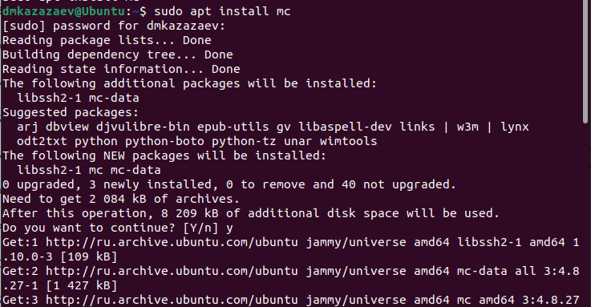{#fig:001 width=70%}

Открываю Midnight Commander. (рис. [-@fig:002])

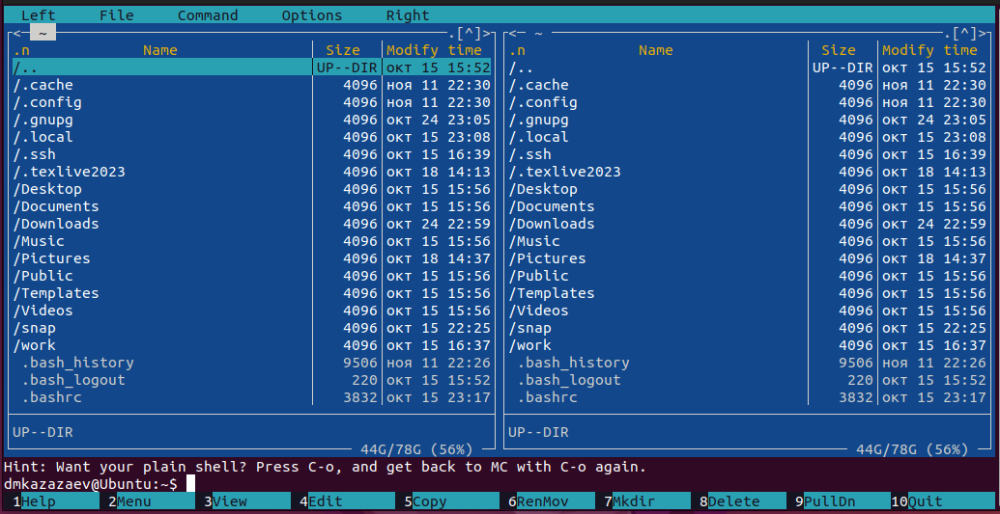{#fig:002 width=70%}

Перехожу в нужный каталог. (рис. [-@fig:003])

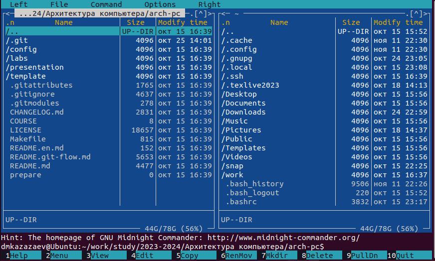{#fig:003 width=70%}

Создаю файл lab5-1.asm через Midnight Commander. (рис. [-@fig:004])

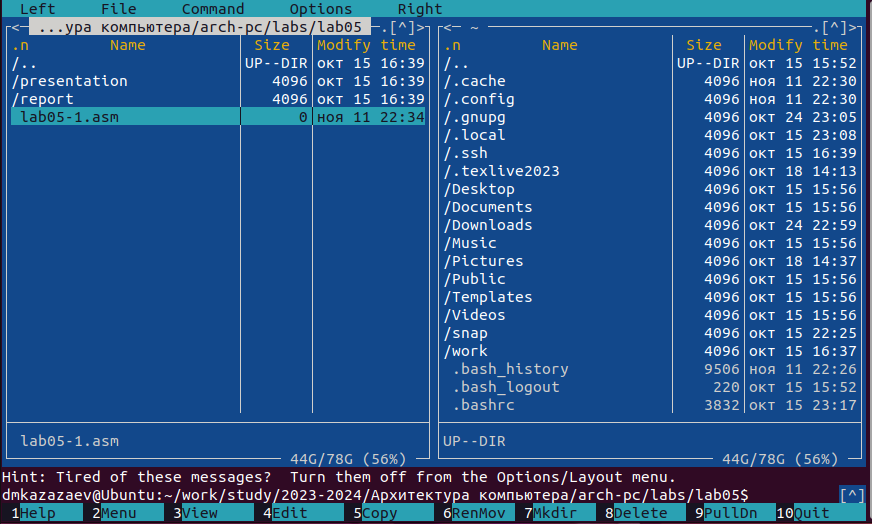{#fig:004 width=70%}

Редактирую файл lab5-1.asm. (рис. [-@fig:005])

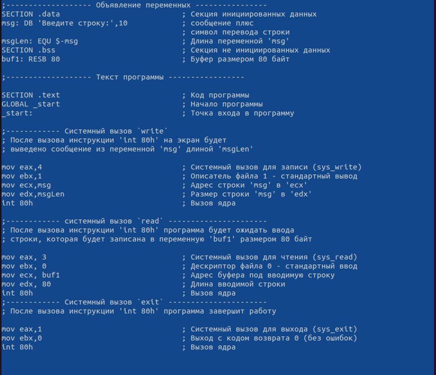{#fig:005 width=70%}

Проверяю на наличие текста программы в файле lab5-1.asm. (рис. [-@fig:006])

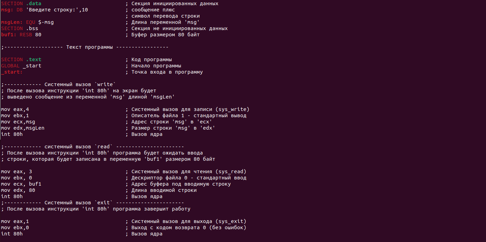{#fig:006 width=70%}

Транислирую файл lab5-1.asm в объектный файл. (рис. [-@fig:007])

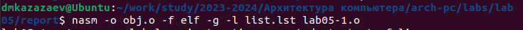{#fig:007 width=70%}

Компоную файл lab5-1.asm в исполняемый файл. (рис. [-@fig:008])

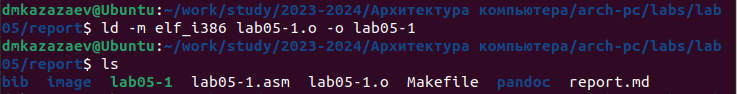{#fig:008 width=70%}

Запускаю программу. (рис. [-@fig:009])

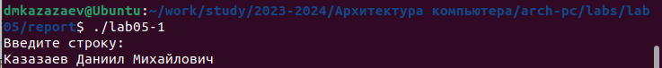{#fig:009 width=70%}

Копирую файл in_out.asm в нужный каталог с помошью Midnight Commander. (рис. [-@fig:010])

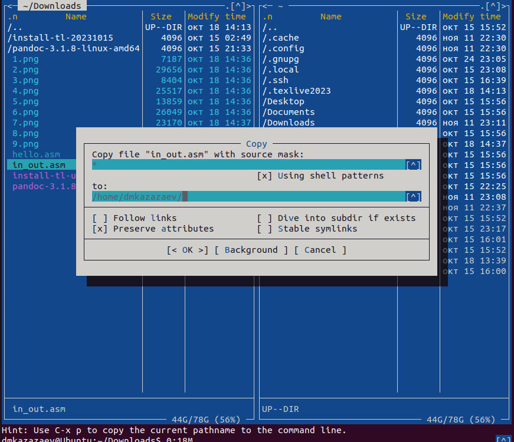{#fig:010 width=70%}

Копирую файл lab5-1.asm с названием lab5-2.asm. (рис. [-@fig:011])

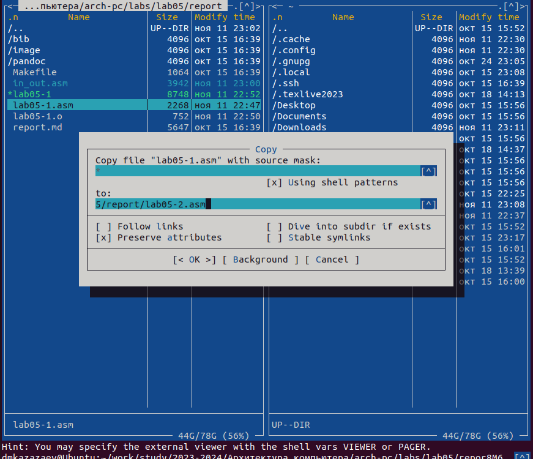{#fig:011 width=70%}

Редактирую файл lab5-2.asm с использованией подпрограмм in_out.asm. (рис. [-@fig:012])

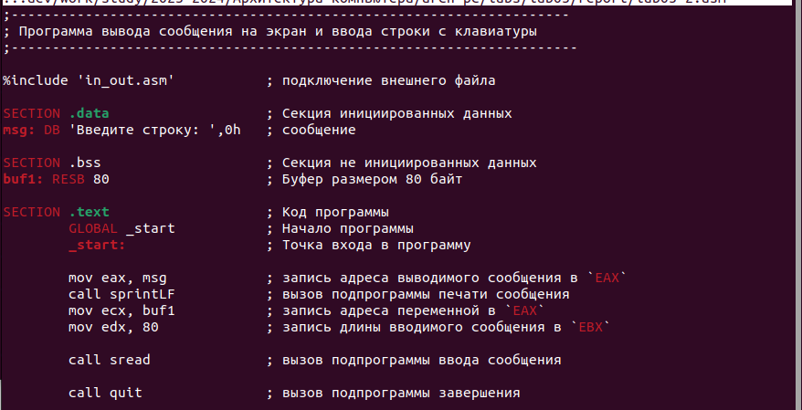{#fig:012 width=70%}

Транслирую и компоную файл lab5-2.asm. (рис. [-@fig:013])

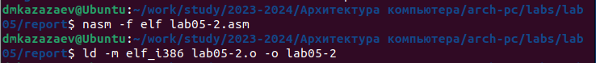{#fig:013 width=70%}

Запускаю исполняемый файл lab5-2. (рис. [-@fig:014])

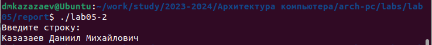{#fig:014 width=70%}

Меняю sprintLF на sprint в lab5-2.asm. (рис. [-@fig:015])

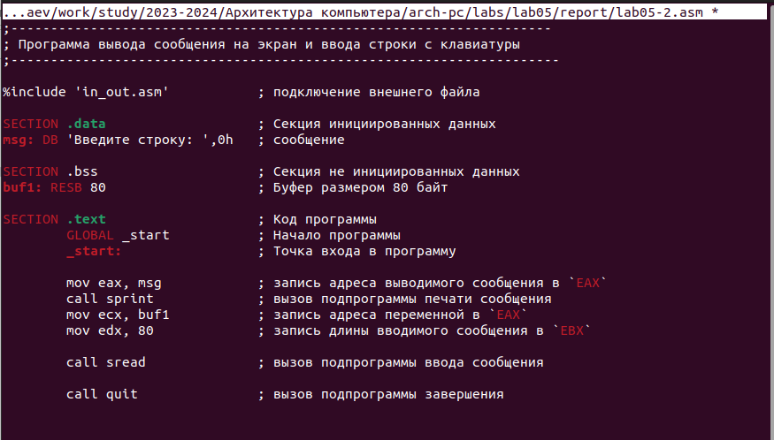{#fig:015 width=70%}

Еще раз транслирую и компоную файл lab5-2.asm после чего запускаю его. (рис. [-@fig:016])

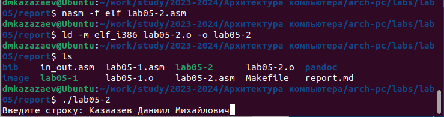{#fig:016 width=70%}

Отличие заключается в том, что с использованием sprintLF ввод происходит с новой строги, а при использовании sprint ввод продолжается на той же строке, на которой находится надпись, выведенная программой

# Выполнение самостоятельной работы
## Задание 1

Копирую файл lab5-1.asm с названием lab5-1-1.asm. (рис. [-@fig:017])

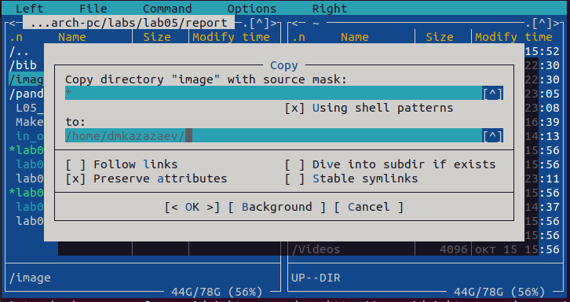{#fig:017 width=70%}

Редактирую файл lab5-1-1.asm. (рис. [-@fig:018])

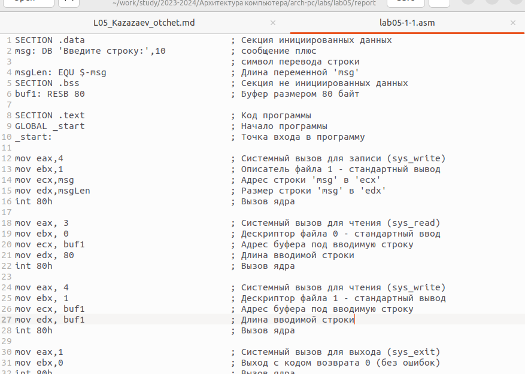{#fig:018 width=70%}

Транслирую и компоную файл lab5-1-1.asm после чего запускаю его. (рис. [-@fig:019])

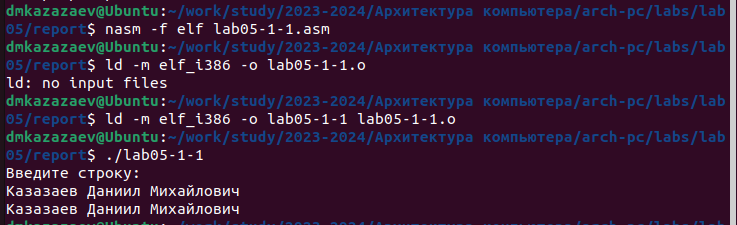{#fig:019 width=70%}

Листинг задания 1

```
SECTION .data				; Секция инициированных данных
msg: DB 'Введите строку:',10 		; сообщение плюс
					; символ перевода строки
msgLen: EQU $-msg 			; Длина переменной 'msg'
SECTION .bss 				; Секция не инициированных данных
buf1: RESB 80 				; Буфер размером 80 байт

SECTION .text 				; Код программы
GLOBAL _start 				; Начало программы
_start: 				; Точка входа в программу

mov eax,4 				; Системный вызов для записи (sys_write)
mov ebx,1 				; Описатель файла 1 - стандартный вывод
mov ecx,msg 				; Адрес строки 'msg' в 'ecx'
mov edx,msgLen 				; Размер строки 'msg' в 'edx'
int 80h 				; Вызов ядра

mov eax, 3 				; Системный вызов для чтения (sys_read)
mov ebx, 0 				; Дескриптор файла 0 - стандартный ввод
mov ecx, buf1 				; Адрес буфера под вводимую строку
mov edx, 80 				; Длина вводимой строки
int 80h 				; Вызов ядра

mov eax, 4 				; Системный вызов для чтения (sys_write)
mov ebx, 1 				; Дескриптор файла 1 - стандартный вывод
mov ecx, buf1 				; Адрес буфера под вводимую строку
mov edx, buf1				; Длина вводимой строки
int 80h 				; Вызов ядра

mov eax,1 				; Системный вызов для выхода (sys_exit)
mov ebx,0 				; Выход с кодом возврата 0 (без ошибок)
int 80h 				; Вызов ядра
```

## Задание 3

Копирую файл lab5-2.asm с названием lab5-2-1.asm. (рис. [-@fig:020])

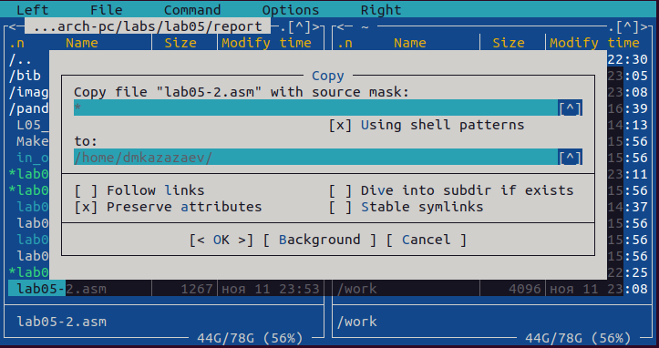{#fig:020 width=70%}

Редактирую файл lab5-2-1.asm. (рис. [-@fig:021])

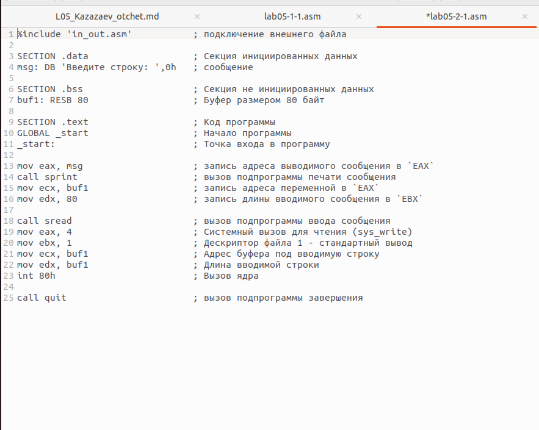{#fig:021 width=70%}

Транслирую и компоную файл lab5-2-1.asm после чего запускаю его. (рис. [-@fig:022])

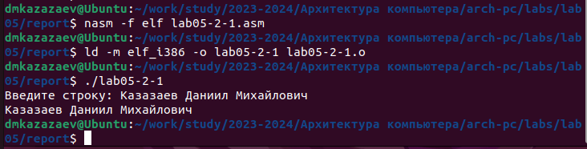{#fig:022 width=70%}

Листинг задания 3

```
%include 'in_out.asm'		; подключение внешнего файла

SECTION .data 			; Секция инициированных данных
msg: DB 'Введите строку: ',0h 	; сообщение

SECTION .bss 			; Секция не инициированных данных
buf1: RESB 80 			; Буфер размером 80 байт

SECTION .text 			; Код программы
GLOBAL _start 			; Начало программы
_start: 			; Точка входа в программу

mov eax, msg 			; запись адреса выводимого сообщения в `EAX`
call sprint 			; вызов подпрограммы печати сообщения
mov ecx, buf1 			; запись адреса переменной в `EAX`
mov edx, 80 			; запись длины вводимого сообщения в `EBX`
	
call sread			; вызов подпрограммы ввода сообщения
mov eax, 4 			; Системный вызов для чтения (sys_write)
mov ebx, 1 			; Дескриптор файла 1 - стандартный вывод
mov ecx, buf1 			; Адрес буфера под вводимую строку
mov edx, buf1			; Длина вводимой строки
int 80h 			; Вызов ядра

call quit 			; вызов подпрограммы завершения
```

# Вывод

При выполнеии лабораторной работы я приобрел практические навыки работы с Midnight Commander. и освоил инструкции языка ассемблера mov и int.

