---
## Front matter
title: "Отчет по лабораторной работе № 6"
subtitle: "Дисциплина: архитектура компьютеров"
author: "Казазаев Даниил Михайлович"

## Generic otions
lang: ru-RU
toc-title: "Содержание"

## Bibliography
bibliography: bib/cite.bib
csl: pandoc/csl/gost-r-7-0-5-2008-numeric.csl

## Pdf output format
toc: true # Table of contents
toc-depth: 2
lof: true # List of figures
lot: false # List of tables
fontsize: 12pt
linestretch: 1.5
papersize: a4
documentclass: scrreprt
## I18n polyglossia
polyglossia-lang:
  name: russian
  options:
	- spelling=modern
	- babelshorthands=true
polyglossia-otherlangs:
  name: english
## I18n babel
babel-lang: russian
babel-otherlangs: english
## Fonts
mainfont: PT Serif
romanfont: PT Serif
sansfont: PT Sans
monofont: PT Mono
mainfontoptions: Ligatures=TeX
romanfontoptions: Ligatures=TeX
sansfontoptions: Ligatures=TeX,Scale=MatchLowercase
monofontoptions: Scale=MatchLowercase,Scale=0.9
## Biblatex
biblatex: true
biblio-style: "gost-numeric"
biblatexoptions:
  - parentracker=true
  - backend=biber
  - hyperref=auto
  - language=auto
  - autolang=other*
  - citestyle=gost-numeric
## Pandoc-crossref LaTeX customization
figureTitle: "Рис."
tableTitle: "Таблица"
listingTitle: "Листинг"
lofTitle: "Список иллюстраций"
lotTitle: "Список таблиц"
lolTitle: "Листинги"
## Misc options
indent: true
header-includes:
  - \usepackage{indentfirst}
  - \usepackage{float} # keep figures where there are in the text
  - \floatplacement{figure}{H} # keep figures where there are in the text
---

# Цель работы

Целью работы является освоение арифметических инструкций языка ассемблера NASM.

# Задания Лабораторной работы

1. Создать файл lab6-1.asm.
2. Отредактировать файл lab6-1.asm.
3. Трансилровать файл lab6-1.asm в объектный файл и запустить его.
4. Изменить текст программы.
5. Трансилровать отредактированный файл lab6-1.asm в объектный файл и запустить его.
6. Создать файл lab6-2.asm.
7. Отредактировать файл lab6-2.asm.
8. Трансилровать файл lab6-1.asm в объектный файл и запустить его.
9. Сделать аналогично файлу lab6-1.asm
10. Создать файл lab6-3.asm.
11. Отредактировать файл lab6-3.asm для вычисления функции (5 * 2 + 3)/3.
12. Трансилровать отредактированный файл lab6-3.asm в объектный файл и запустить его.
13. Отредактировать файл lab6-3.asm для вычисления функции (4 * 6 + 2)/5.
14. Трансилровать отредактированный файл lab6-3.asm в объектный файл и запустить его.
15. Создать файл variant.asm.
16. Отредактировать файл variant.asm, чтобы получить номер варианта для самостоятьной работы.
17. Трансилровать файл variant.asm в объектный файл и запустить его.
18. Ответить на вопросы, связанные с файлом variant.asm.
# Задания Самостоятельной работы
1. Написать программу вычисления выражения 𝑦 = 𝑓(𝑥). 

# Выполнение лабораторной работы

Создаю файл lab6-1.asm. (рис. [-@fig:001])

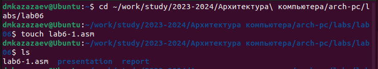{#fig:001 width=70%}

Редактирую файл lab6-1.asm. (рис. [-@fig:002])

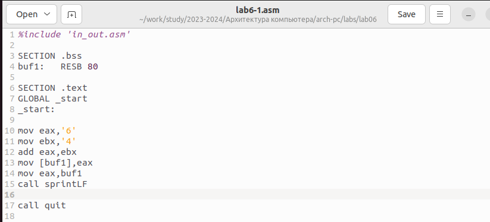{#fig:002 width=70%}

Транислирую файл lab6-1.asm в объектный файл, после чего запускаю его. (рис. [-@fig:003])

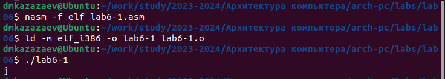{#fig:003 width=70%}

Немного редактирую файл lab6-1.asm. (рис. [-@fig:004])

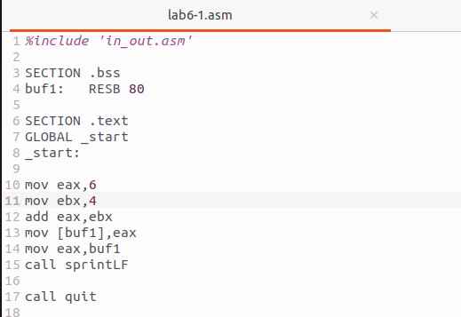{#fig:004 width=70%}

Транислирую файл lab6-1.asm в объектный файл, после чего запускаю его. (рис. [-@fig:005])

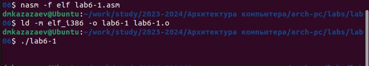{#fig:005 width=70%}

Созадю файл lab6-2.asm. (рис. [-@fig:006])

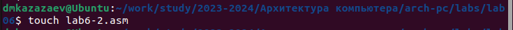{#fig:006 width=70%}

Редактирую файл lab6-2.asm. (рис. [-@fig:007])

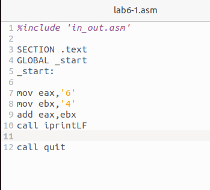{#fig:007 width=70%}

Транислирую файл lab6-2.asm в объектный файл, после чего запускаю его. (рис. [-@fig:008])

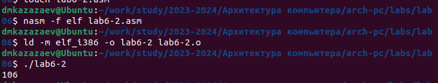{#fig:008 width=70%}

Редактирую файл. (рис. [-@fig:009])

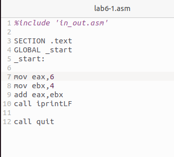{#fig:009 width=70%}

Транислирую файл lab6-2.asm в объектный файл, после чего запускаю его. (рис. [-@fig:010])

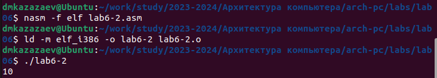{#fig:010 width=70%}

Меняю sprintLF на sprint в файле lab6-2.asm. (рис. [-@fig:011])

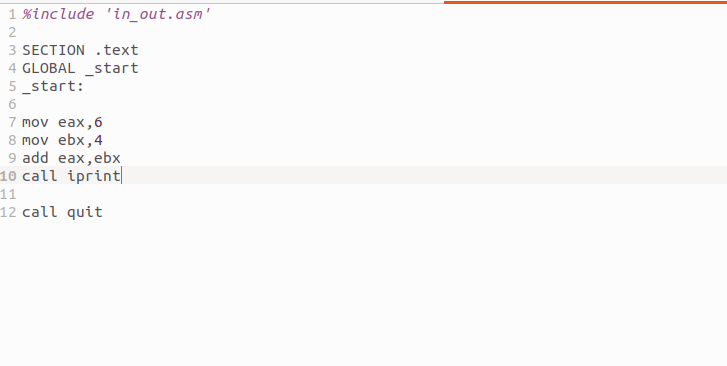{#fig:011 width=70%}

Транислирую файл lab6-2.asm в объектный файл, после чего запускаю его. (рис. [-@fig:012])

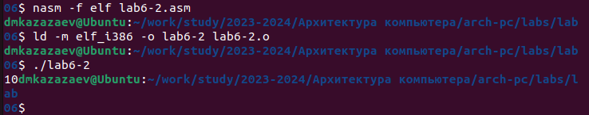{#fig:012 width=70%}

Отличие заключается в том, что с использованием sprintLF ввод происходит с новой строки, а при использовании sprint ввод продолжается на той же строке, на которой находится надпись, выведенная программой 

Создаю файл lab6-3.asm. (рис. [-@fig:013])

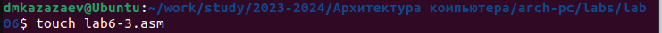{#fig:013 width=70%}

Редактирую файл lab6-3.asm для вычисления функции (5 * 2 + 3)/3. (рис. [-@fig:014])

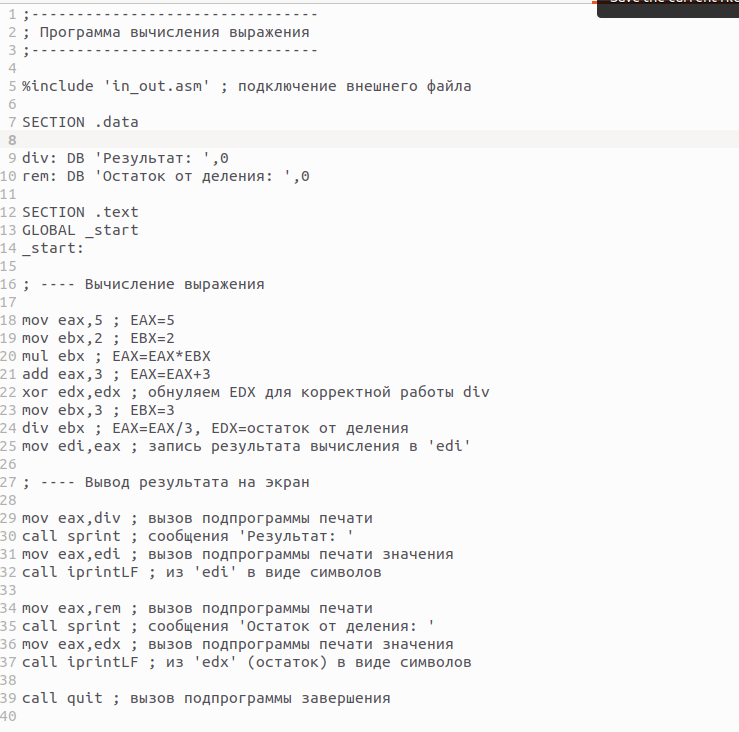{#fig:014 width=70%}

Транислирую файл lab6-3.asm в объектный файл, после чего запускаю его. (рис. [-@fig:015])

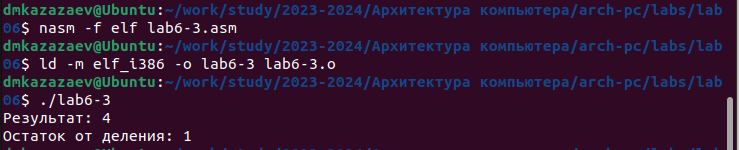{#fig:015 width=70%}

Редактирую файл lab6-3.asm для вычисления функции (4 * 6 + 2)/5. (рис. [-@fig:016])

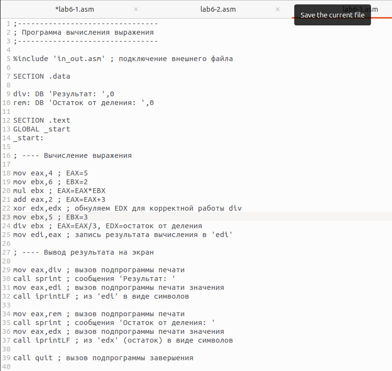{#fig:016 width=70%}

Транислирую файл lab6-3.asm в объектный файл, после чего запускаю его. (рис. [-@fig:017])

{#fig:017 width=70%}

Создаю файл variant.asm. (рис. [-@fig:018])

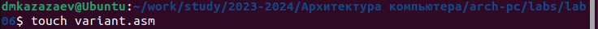{#fig:018 width=70%}

Редактирую файл variant.asm. (рис. [-@fig:019])

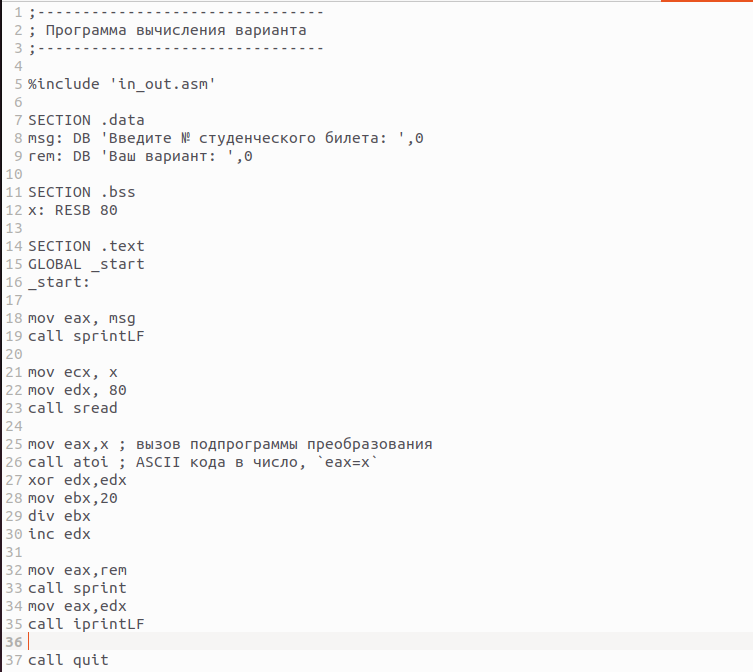{#fig:019 width=70%}

Транислирую файл variant.asm в объектный файл, после чего запускаю его, чтобы получить номер варианта. (рис. [-@fig:020])

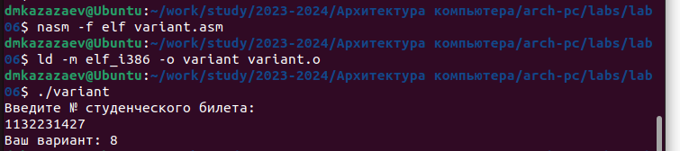{#fig:020 width=70%}

## Ответы на вопросы

1. Какие строки листинга 6.4 отвечают за вывод на экран сообщения ‘Ваш вариант:’?

Ответ:
```
mov eax,rem
call sprint
```

2. Для чего используется следующие инструкции?

```
mov ecx, x
mov edx, 80
call sread
```

Ответ:
Инструкция ```mov ecx, x``` используется, чтобы положить адрес вводимой строки x в регистр ecx, ```mov edx, 80``` - запись в регистр edx длины вводимой строки, ```call sread``` - вызов подпрограммы из внешнего файла, обеспечивающей ввод сообщения с клавиатуры

3. Для чего используется инструкция “call atoi”?

Ответ:
С помощью “call atoi” мы вызываем функцию atoi, которая преобразует ascii-код символа в целое число и записывает результат в регистр eax (перед вызовом atoi в регистр eax необходимо записать число). 

4. Какие строки листинга 6.4 отвечают за вычисления варианта?

Ответ:
```
xor edx,edx
mov ebx,20
div ebx
inc edx
```

5. В какой регистр записывается остаток от деления при выполнении инструкции “div ebx”?

Ответ:

Остаток запиысвается в регистр edx.

6. Для чего используется инструкция “inc edx”?

Ответ:

Для того, чтобы инкрементировать значение в регистре edx.

7. Какие строки листинга 6.4 отвечают за вывод на экран результата вычислений?

Ответ:
```
mov eax,edx
call iprintLF
```

# Выполнение самостоятельной работы

После выполнения прошлой программы я получил вариант 8.

Создаю файл х.asm, в котором буду выполнять задание. (рис. [-@fig:021])

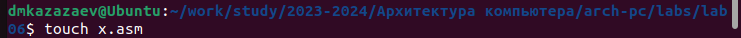{#fig:021 width=70%}

Редактирую файл х.asm. (рис. [-@fig:022])

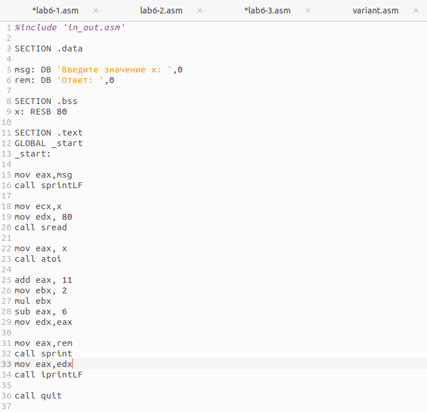{#fig:022 width=70%}

Транислирую файл х.asm в объектный файл, после чего запускаю его. (рис. [-@fig:023])

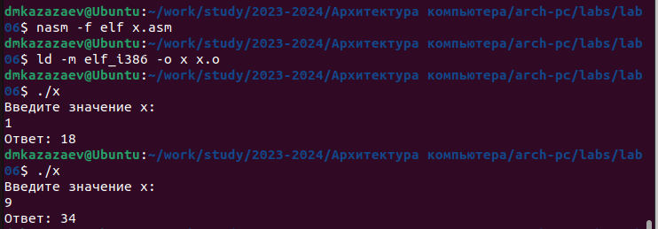{#fig:023 width=70%}

Листинг файла х

```
%include 'in_out.asm'

SECTION .data

msg: DB 'Введите значение х: ',0
rem: DB 'Ответ: ',0

SECTION .bss
x: RESB 80

SECTION .text
GLOBAL _start
_start:

mov eax,msg
call sprintLF

mov ecx,x
mov edx, 80
call sread

mov eax, x
call atoi

add eax, 11
mov ebx, 2
mul ebx
sub eax, 6
mov edx,eax

mov eax,rem
call sprint
mov eax,edx
call iprintLF

call quit
```

# Вывод

При выполнении данной лаборатной работы я освоил арифметические инструкции языка ассемблера NASM.

