---
## Front matter
title: "Отчет по лабораторной работе № 7"
subtitle: "Дисциплина: архитектура компьютеров"
author: "Казазаев Даниил Михайлович"

## Generic otions
lang: ru-RU
toc-title: "Содержание"

## Bibliography
bibliography: bib/cite.bib
csl: pandoc/csl/gost-r-7-0-5-2008-numeric.csl

## Pdf output format
toc: true # Table of contents
toc-depth: 2
lof: true # List of figures
lot: false # List of tables
fontsize: 12pt
linestretch: 1.5
papersize: a4
documentclass: scrreprt
## I18n polyglossia
polyglossia-lang:
  name: russian
  options:
	- spelling=modern
	- babelshorthands=true
polyglossia-otherlangs:
  name: english
## I18n babel
babel-lang: russian
babel-otherlangs: english
## Fonts
mainfont: PT Serif
romanfont: PT Serif
sansfont: PT Sans
monofont: PT Mono
mainfontoptions: Ligatures=TeX
romanfontoptions: Ligatures=TeX
sansfontoptions: Ligatures=TeX,Scale=MatchLowercase
monofontoptions: Scale=MatchLowercase,Scale=0.9
## Biblatex
biblatex: true
biblio-style: "gost-numeric"
biblatexoptions:
  - parentracker=true
  - backend=biber
  - hyperref=auto
  - language=auto
  - autolang=other*
  - citestyle=gost-numeric
## Pandoc-crossref LaTeX customization
figureTitle: "Рис."
tableTitle: "Таблица"
listingTitle: "Листинг"
lofTitle: "Список иллюстраций"
lotTitle: "Список таблиц"
lolTitle: "Листинги"
## Misc options
indent: true
header-includes:
  - \usepackage{indentfirst}
  - \usepackage{float} # keep figures where there are in the text
  - \floatplacement{figure}{H} # keep figures where there are in the text
---

# Цель работы

Целью работы является Изучение команд условного и безусловного переходов. Приобретение навыков написания программ с использованием переходов. Знакомство с назначением и структурой файла
листинга.

# Задания Лабораторной работы

1. Создать файл lab7-1.asm.
2. Отредактировать файл lab7-1.asm.
3. Создать исполняемыйв файл lab7-1.asm и запустить его.
4. Изменить текст программы.
5. Трансилровать отредактированный файл lab7-1.asm в объектный файл и запустить его.
6. Создать файл lab7-2.asm.
7. Отредактировать файл lab7-2.asm.
8. Создать исполняемыйв файл lab7-2.asm и запустить его, проверив работу для разных сначений В.
9. Создайте файл листинга для программы из файла lab7-2.asm.
10. Откройте файл листинга lab7-2.lst с помощью любого текстового редактора и изучить с его форматом и содержимым.
11. Подробно описать содержимое трёх строк.
12. Удалить один из операндов в файле lab7-2.asm, после чего выполнить трансляцию с получением айла листинга.

# Задания Самостоятельной работы

1. Написать программу нахождения наименьшей из 3 целочисленных переменных a,b и c.
2. Написать программу, которая для введенных с клавиатуры значений 𝑥 и 𝑎 вычисляет
значение заданной функции 𝑓(𝑥) и выводит результат вычислений.

# Выполнение лабораторной работы

Создаю файл lab7-1.asm. (рис. [-@fig:001])

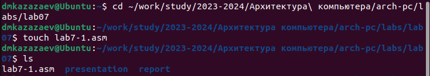{#fig:001 width=70%}

Редактирую файл lab7-1.asm. (рис. [-@fig:002])

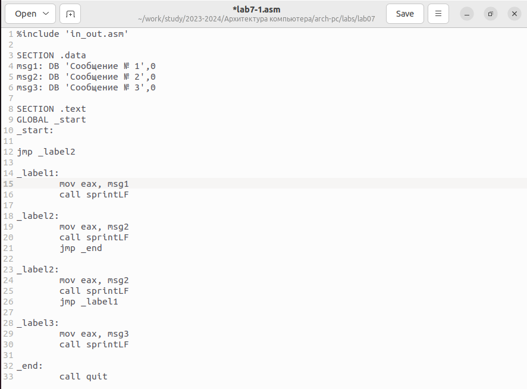{#fig:002 width=70%}

Транислирую файл lab7-1.asm в объектный файл, после чего запускаю его. (рис. [-@fig:003])

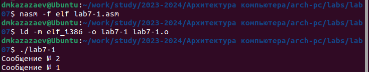{#fig:003 width=70%}

Немного редактирую файл lab7-1.asm. (рис. [-@fig:004])

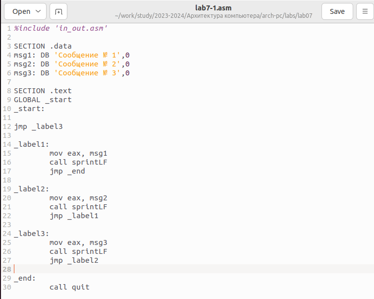{#fig:004 width=70%}

Транислирую файл lab7-1.asm в объектный файл, после чего запускаю его. (рис. [-@fig:005])

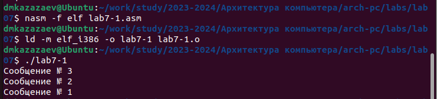{#fig:005 width=70%}

Созадю файл lab7-2.asm. (рис. [-@fig:006])

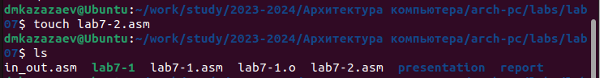{#fig:006 width=70%}

Редактирую файл lab7-2.asm. (рис. [-@fig:007])

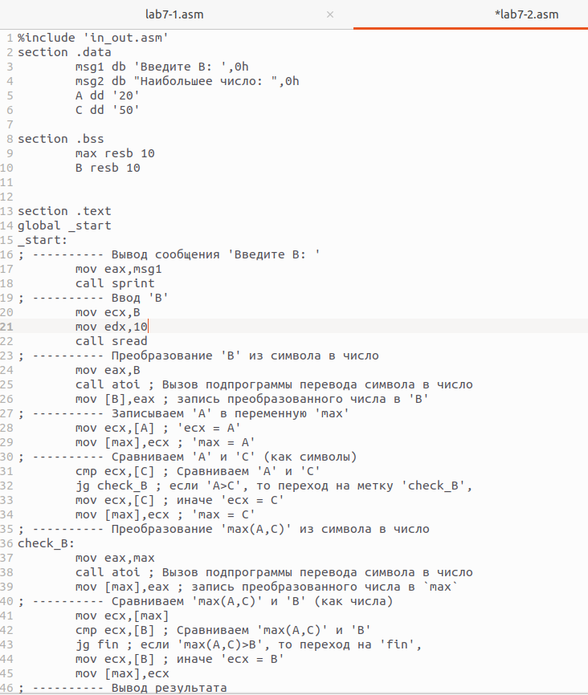{#fig:007 width=70%}

Создать исполняемыйв файл lab7-2.asm и запустить его, проверив работу для разных сначений В. (рис. [-@fig:008])

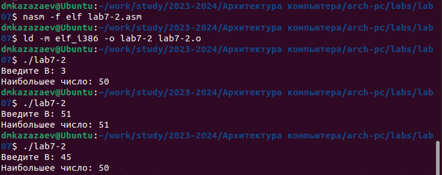{#fig:008 width=70%}

Создаю файл листинга для программы из файла lab7-2.asm с помощью команжы ```nasm -f elf -l lab7-2.lst lab7-2.asm```. (рис. [-@fig:009])

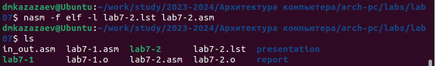{#fig:009 width=70%}

Открываю листинг в текстовом редакторе, чтобы изучить содержимое. (рис. [-@fig:010])

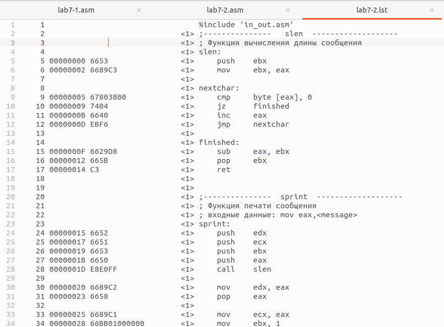{#fig:010 width=70%}

Далее я буду описывать эти три строчки кода. (рис. [-@fig:011])

{#fig:011 width=70%}

1) "10" - номер строкии кода; "00000006" - адрес строки; "7403" - машинный код; "jz" - инструкция, выполняющаа переход к метке, если флаг нуля установлен; "finished" - метка, к которой выполняется переход.

2) "11" - номер строкии кода; "00000008" - адрес строки; "40" - машинный код; "inc" - команда, которая увеличивает число на единицу; "eax" - элемент, который повышается на единицу.

3) "12" - номер строкии кода; "00000009" - адрес строки; "EBF8" - машинный код; "jmp" - инструкция выполняющая безусловный переход к метке; "nextchar" - метка, к которой выполняется переход.

Удаляю один из операндов в файле lab7-2.asm. (рис. [-@fig:012])

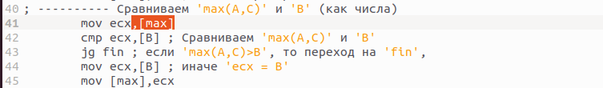{#fig:012 width=70%}

Выполняю трансляцию lab7-2.asm с получением файла листинга. (рис. [-@fig:013])

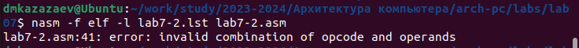{#fig:013 width=70%}

Выполнение команды ``` nasm -f elf -l lab7-2.lst lab7-2.asm ``` не создало ниодного файла, так как инструкция "mov" не может работать имея толья один операнд.

# Выполнение самостоятельной работы

После выполнения прошлой лабораторной работы я получил вариант 8.

## Задание 1

Создаю файл task.asm, в котором буду выполнять задание. (рис. [-@fig:014])

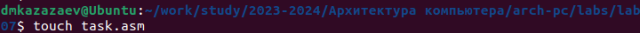{#fig:014 width=70%}

Редактирую файл task.asm. (рис. [-@fig:015])

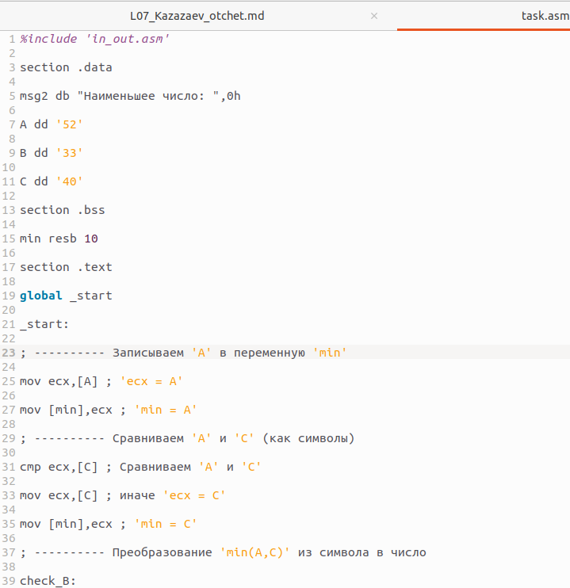{#fig:015 width=70%}

Транислирую файл task.asm в объектный файл, после чего запускаю его. (рис. [-@fig:016])

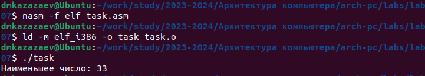{#fig:016 width=70%}

Программа работает корректно.

**Листинг task.asm**

```
%include 'in_out.asm'

section .data

msg2 db "Наименьшее число: ",0h

A dd '52'

B dd '33'

C dd '40'

section .bss

min resb 10

section .text

global _start

_start:

; ---------- Записываем 'A' в переменную 'min'

mov ecx,[A] ; 'ecx = A'

mov [min],ecx ; 'min = A'

; ---------- Сравниваем 'A' и 'С' (как символы)

cmp ecx,[C] ; Сравниваем 'A' и 'С'

mov ecx,[C] ; иначе 'ecx = C'

mov [min],ecx ; 'min = C'

; ---------- Преобразование 'min(A,C)' из символа в число

check_B:

mov eax,min

call atoi ; Вызов подпрограммы перевода символа в число

mov [min],eax ; запись преобразованного числа в min

; ---------- Сравниваем 'min(A,C)' и 'B' (как числа)

cmp ecx,[B] ; Сравниваем 'min(A,C)' и 'B'

jg fin ; если 'min(A,C)<B', то переход на 'fin',

mov ecx,[B] ; иначе 'ecx = B'

mov [min],ecx

; ---------- Вывод результата

fin:

mov eax, msg2

call sprint ; Вывод сообщения 'Наименьшее число: '

mov ecx,[min]

call iprintLF ; Вывод 'min(A,B,C)'

call quit ; Выход
```
## Задание 2

Создаю файл task2.asm. (рис. [-@fig:017])

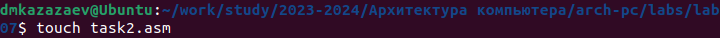{#fig:017 width=70%}

Открываю его и начинаю писать программу для вычисления заданной функции f(x). Так как у меня восьмой вариант, мой вид функции:
3*а, если а < 3 и х + 1, если а >= 3. (рис. [-@fig:018])

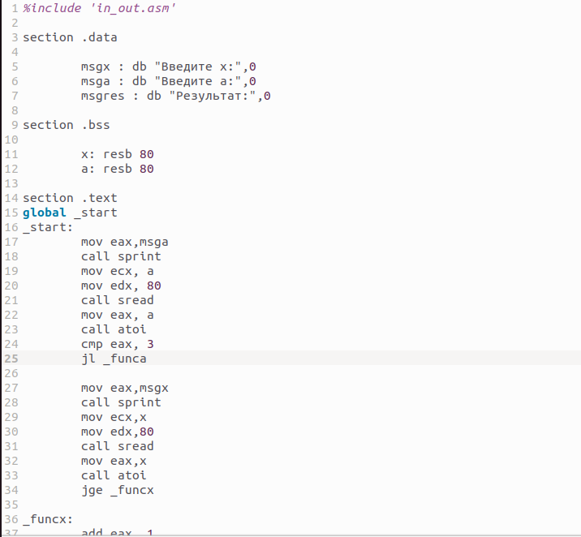{#fig:018 width=70%}

Транислирую файл task2.asm в объектный файл. (рис. [-@fig:019])

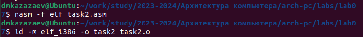{#fig:019 width=70%}

Проверяю исправность работы программы. (рис. [-@fig:020])

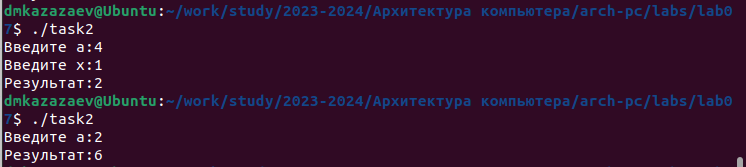{#fig:020 width=70%}

Пришлось изменить порядок ввода значений х и а, чтобы программа работала корректно

**Листинг task2.asm**

```
%include 'in_out.asm'

section .data

	msgx : db "Введите х:",0
	msga : db "Введите а:",0
	msgres : db "Результат:",0

section .bss

	x: resb 80
	a: resb 80

section .text
global _start
_start:
	mov eax,msga
	call sprint
	mov ecx, a
	mov edx, 80
	call sread
	mov eax, a
	call atoi
	cmp eax, 3
	jl _funca
	
	mov eax,msgx
	call sprint
	mov ecx,x
	mov edx,80
	call sread
	mov eax,x
	call atoi
	jge _funcx

_funcx:
	add eax, 1
	jmp _fin
	
_funca:
	mov edx,3
	mul edx
	jmp _fin
	
_fin:
	mov ecx, eax
	mov eax, msgres
	call sprint
	mov eax,ecx
	call iprintLF
	call quit
```

# Вывод

При выполнении данной лаборатной работы я освоил команды условного и безусловного переходов, приобрел навыки написания программ с использованием переходов и ознакомился с назначением и структурой файла листинга.

