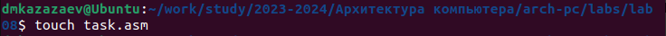

---
## Front matter
title: "Отчет по лабораторной работе № 8"
subtitle: "Дисциплина: архитектура компьютеров"
author: "Казазаев Даниил Михайлович"

## Generic otions
lang: ru-RU
toc-title: "Содержание"

## Bibliography
bibliography: bib/cite.bib
csl: pandoc/csl/gost-r-7-0-5-2008-numeric.csl

## Pdf output format
toc: true # Table of contents
toc-depth: 2
lof: true # List of figures
lot: false # List of tables
fontsize: 12pt
linestretch: 1.5
papersize: a4
documentclass: scrreprt
## I18n polyglossia
polyglossia-lang:
  name: russian
  options:
	- spelling=modern
	- babelshorthands=true
polyglossia-otherlangs:
  name: english
## I18n babel
babel-lang: russian
babel-otherlangs: english
## Fonts
mainfont: PT Serif
romanfont: PT Serif
sansfont: PT Sans
monofont: PT Mono
mainfontoptions: Ligatures=TeX
romanfontoptions: Ligatures=TeX
sansfontoptions: Ligatures=TeX,Scale=MatchLowercase
monofontoptions: Scale=MatchLowercase,Scale=0.9
## Biblatex
biblatex: true
biblio-style: "gost-numeric"
biblatexoptions:
  - parentracker=true
  - backend=biber
  - hyperref=auto
  - language=auto
  - autolang=other*
  - citestyle=gost-numeric
## Pandoc-crossref LaTeX customization
figureTitle: "Рис."
tableTitle: "Таблица"
listingTitle: "Листинг"
lofTitle: "Список иллюстраций"
lotTitle: "Список таблиц"
lolTitle: "Листинги"
## Misc options
indent: true
header-includes:
  - \usepackage{indentfirst}
  - \usepackage{float} # keep figures where there are in the text
  - \floatplacement{figure}{H} # keep figures where there are in the text
---

# Цель работы

Целью работы является приобретение навыков написания программ с использование циклов и обработкой аргументов командной строки.


# Задания Лабораторной работы

1. Создать файл lab8-1.asm.
2. Ввести в файл lab8-1.asm текст программы из листинга 8.1. Создайть исполняемый файл
и проверить его работу.
3. Изменить текст программы, добавив изменение значения регистра есх в цикле. Создайть исполняемый файл и проверить его работу.
4. Еще раз изменить текст программы, добавив команды push и pop. Создайть исполняемый файл и проверить его работу.
5. Создать файл lab8-2.asm.
6. Ввести в файл lab8-2.asm текст программы из листинга 8.2. Создайть исполняемый файл
и проверить его работу.
7. Создать файл lab8-3.asm.
8. Ввести в файл lab8-3.asm текст программы из листинга 8.3. Создайть исполняемый файл
и проверить его работу.
9. Отредактировать текст программы, чтобы результатом было произдение введенных аргументов.


# Задания Самостоятельной работы

1. Написать программу, которая нохид сумму значений функции f(x) для х = х1,х2,х3,...хn

# Выполнение лабораторной работы

Создаю файл lab8-1.asm. (рис. [-@fig:001])

{#fig:001 width=70%}

Ввожу в файл lab8-1.asm текст программы из листинга 8.1. (рис. [-@fig:002])

{#fig:002 width=70%}

Транислирую файл lab8-1.asm в объектный файл, после чего запускаю его. (рис. [-@fig:003])

{#fig:003 width=70%}

Немного редактирую файл lab8-1.asm. (рис. [-@fig:004])

{#fig:004 width=70%}

Транислирую файл lab8-1.asm в объектный файл, после чего запускаю его. (рис. [-@fig:005])

{#fig:005 width=70%}

Разница в том, что из регистра ```ecx``` с каждым проходом цикла вычитается единица (```sub ecx, 1```). Поэтому число проходов цикла не соответствует значению ```N```, введенному с клавиатуры.

Еще раз немного редактирую файл lab8-1.asm. (рис. [-@fig:006])

{#fig:006 width=70%}

Транислирую файл lab8-1.asm в объектный файл, после чего запускаю его. (рис. [-@fig:007])

{#fig:007 width=70%}

Количество циклов равно введенному числу ```N```.

Создаю файл lab8-2.asm. (рис. [-@fig:008])

{#fig:008 width=70%}

Переношу в файл lab8-2.asm текст программы из листинга 8.2. (рис. [-@fig:009])

{#fig:009 width=70%}

Транислирую файл lab8-2.asm в объектный файл, после чего запускаю его. (рис. [-@fig:010])

{#fig:010 width=70%}

Создаю файл lab8-3.asm. (рис. [-@fig:011])

{#fig:011 width=70%}

Переношу в файл lab8-3.asm текст программы из листинга 8.3. (рис. [-@fig:012])

{#fig:012 width=70%}

{#fig:012 width=70%}

Транислирую файл lab8-3.asm в объектный файл, после чего запускаю его. (рис. [-@fig:013])

{#fig:013 width=70%}

Немного редактирую файл lab8-3.asm, чтобы результатом было произведение введенных чисел. (рис. [-@fig:014])

{#fig:0014 width=70%}

Транислирую файл lab8-3.asm в объектный файл, после чего запускаю его. (рис. [-@fig:015])

{#fig:015 width=70%}

# Выполнение самостоятельной работы

После выполнения прошлой лабораторной работы я получил вариант 8.

## Задание 1

Создаю файл task.asm, в котором буду выполнять задание. (рис. [-@fig:016])

{#fig:016 width=70%}

Редактирую файл task.asm. (рис. [-@fig:017])
	
{#fig:017 width=70%}

Транислирую файл task.asm в объектный файл, после чего запускаю его. (рис. [-@fig:017])

{#fig:017 width=70%}

Программа работает корректно.

**Листинг task.asm**

```
%include 'in_out.asm'
SECTION .data
msg db "Результат: ",0

SECTION .text
global _start

_start:

	pop ecx 
	pop edx 	
	sub ecx,1 	
	mov esi, 0	
		
next:
	cmp ecx,0h 	
	jz _end 
		
	pop eax 	
	call atoi 	
	mov ebx, 2
	imul ebx
	add esi, eax
	add esi, 7

	loop next 	
_end:
	mov eax, msg 	
	call sprint
	mov eax, esi 	
	call iprintLF 	
	call quit 	
```

#Вывод

При выполнении лабораторной работы я приобрел навыки написания программ с использование циклов и обработкой аргументов командной строки.

