---
## Front matter
title: "Отчет по лабораторной работе № 9"
subtitle: "Дисциплина: архитектура компьютеров"
author: "Казазаев Даниил Михайлович"

## Generic otions
lang: ru-RU
toc-title: "Содержание"

## Bibliography
bibliography: bib/cite.bib
csl: pandoc/csl/gost-r-7-0-5-2008-numeric.csl

## Pdf output format
toc: true # Table of contents
toc-depth: 2
lof: true # List of figures
lot: false # List of tables
fontsize: 12pt
linestretch: 1.5
papersize: a4
documentclass: scrreprt
## I18n polyglossia
polyglossia-lang:
  name: russian
  options:
	- spelling=modern
	- babelshorthands=true
polyglossia-otherlangs:
  name: english
## I18n babel
babel-lang: russian
babel-otherlangs: english
## Fonts
mainfont: PT Serif
romanfont: PT Serif
sansfont: PT Sans
monofont: PT Mono
mainfontoptions: Ligatures=TeX
romanfontoptions: Ligatures=TeX
sansfontoptions: Ligatures=TeX,Scale=MatchLowercase
monofontoptions: Scale=MatchLowercase,Scale=0.9
## Biblatex
biblatex: true
biblio-style: "gost-numeric"
biblatexoptions:
  - parentracker=true
  - backend=biber
  - hyperref=auto
  - language=auto
  - autolang=other*
  - citestyle=gost-numeric
## Pandoc-crossref LaTeX customization
figureTitle: "Рис."
tableTitle: "Таблица"
listingTitle: "Листинг"
lofTitle: "Список иллюстраций"
lotTitle: "Список таблиц"
lolTitle: "Листинги"
## Misc options
indent: true
header-includes:
  - \usepackage{indentfirst}
  - \usepackage{float} # keep figures where there are in the text
  - \floatplacement{figure}{H} # keep figures where there are in the text
---

# Цель работы

Целью работы является Приобретение навыков написания программ с использованием подпрограмм. Знакомство с методами отладки при помощи GDB и его основными возможностями.


# Задания Лабораторной работы

1. Создать файл lab9-1.asm.
2. Ввести в файл lab9-1.asm текст программы из листинга 9.1. Создайть исполняемый файл
и проверить его работу.
3. Изменить программу, добавив подпрограмму _subcalcul в подпрограмму _calcul для вычисления выражения 𝑓(𝑔(𝑥)), где 𝑥 вводится с клавиатуры, 𝑓(𝑥) = 2𝑥 + 7, 𝑔(𝑥) = 3𝑥 − 1.
4. Создать файл lab9-2.asm.
5. Ввести в файл lab9-2.asm текст программы из листинга 9.2. Создайть исполняемый файл
для работы с GDB.
6. Проверить работу программы, запустив ее в оболочке GDB.
7. Установить брейкпоинт на метке _start
8. Посмотреть дисассимилированный код программы с помощью команды ```disassemble```
начиная с метки _start. Переключитесь на отображение команд с Intel’овским синтаксисом, введя команду ```set disassembly-flavor intel```
9. Перечислить различия отображения синтаксиса машинных команд в режимах ATT и Intel.
10. Включить режим псевдообработки и проверить наличие точки остановы, которая была установлена ранее.
11. Поставить точку остановка по адресу инструкции.
12. Выполнить пять инструкций с помощью команды ```stepi 5``` и указать, какие значения регистров изменились.
13. Посмотрить значение переменной msg1 по имени.
14. Изменить первый симфол в переменной msg1.
15. Заменить любой симфол в переменной msg2.
16. Вывести в различных форматах значение регистра edx.
17. Объяснить разницу вывода команд p/s $ebx.
18. Скопировать файл lab8-2.asm из прошлой лабораторной работы, назвав его lab9-2.asm.
19. Создать испольняймый фалй из файла lab9-2.asm для работы с GDB.
20. Установить брейкпоинт на метке _start.
21. Посмотреть позиции стека.
22. Объяснить, почему шаг изменения адреса рамен 4-м.


# Задания Самостоятельной работы

1. Преобразовать программу из лабораторной работы №8 (Задание №1 для самостоятельной работы), реализовав вычисление значения функции 𝑓(𝑥) как подпрограмму.
2. С помощью отладчика GDB, анализируя изменения значений регистров, определить ошибку и исправьте ее в тексте листинга программы 9.3.


# Выполнение лабораторной работы

Создаю файл lab9-1.asm. (рис. [-@fig:001])

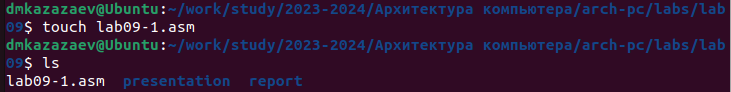{#fig:001 width=70%}

Ввожу в файл lab9-1.asm текст программы из листинга 9.1. (рис. [-@fig:002])

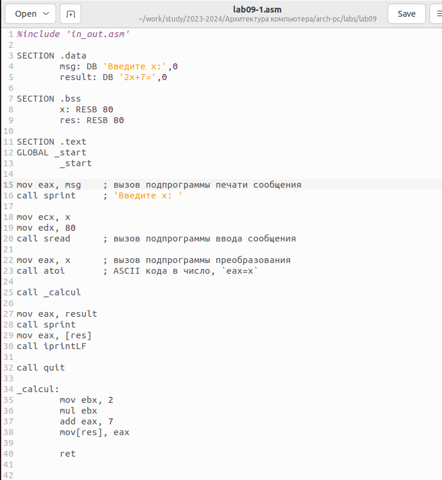{#fig:002 width=70%}

Транислирую файл lab9-1.asm в объектный файл, после чего запускаю его. (рис. [-@fig:003])

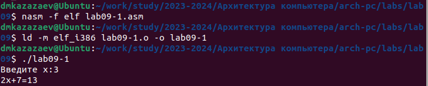{#fig:003 width=70%}

Редактирую файл lab9-1.asm, добавляя подпрограмму _subcalcul в подпрограмму _calcul.(рис. [-@fig 004])

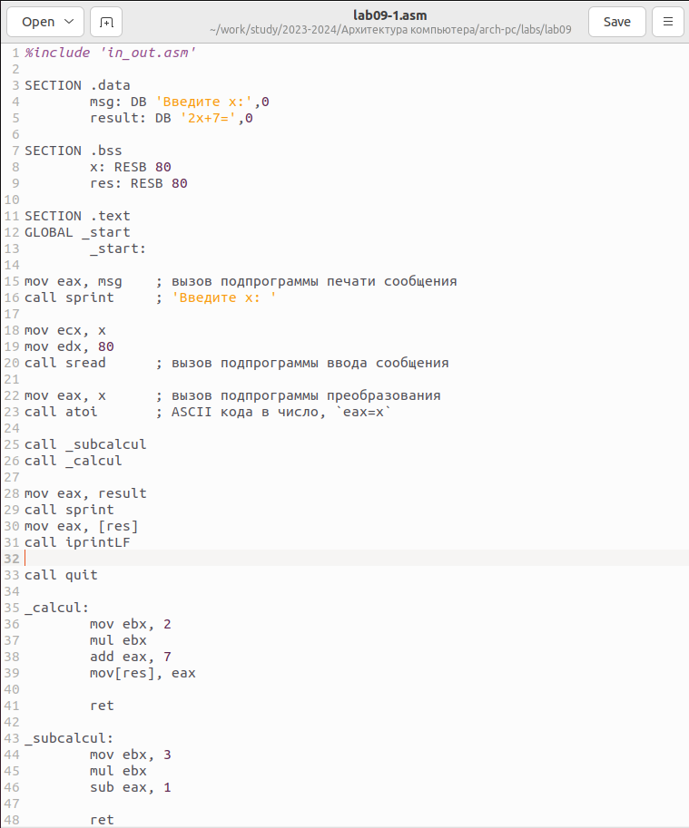{#fig:004 width=70%}

Транислирую файл lab9-1.asm в объектный файл, после чего запускаю его. (рис. [-@fig:005])

{#fig:005 width=70%}

**Листинг программы lab9-1.asm**

```
%include 'in_out.asm'

SECTION .data
	msg: DB 'Введите х:',0
	result: DB '2х+7=',0
	
SECTION .bss
	x: RESB 80
	res: RESB 80
	
SECTION .text
GLOBAL _start
	_start:
	
mov eax, msg	; вызов подпрограммы печати сообщения
call sprint	; 'Введите x: '

mov ecx, x
mov edx, 80
call sread	; вызов подпрограммы ввода сообщения

mov eax, x	; вызов подпрограммы преобразования
call atoi	; ASCII кода в число, `eax=x`

call _subcalcul
call _calcul

mov eax, result
call sprint
mov eax, [res]
call iprintLF

call quit

_calcul:
	mov ebx, 2
	mul ebx
	add eax, 7
	mov[res], eax
	
	ret

_subcalcul:
	mov ebx, 3
	mul ebx
	sub eax, 1
	
	ret
```

Создаю файл lab9-2.asm. (рис. [-@fig:006])

{#fig:006 width=70%}

Переношу в файл lab9-2.asm текст программы из листинга 9.2. (рис. [-@fig:007])

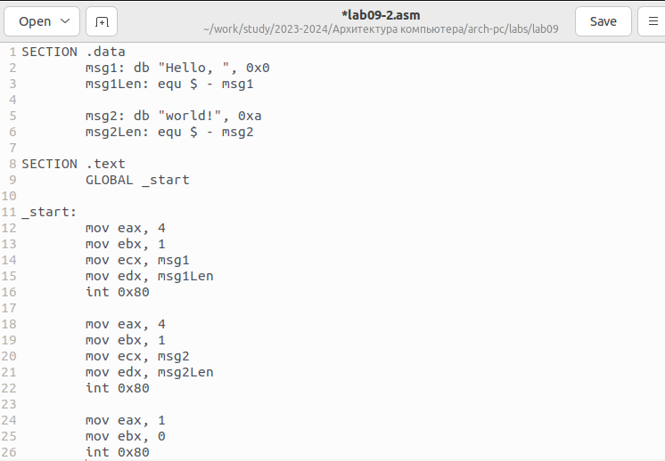{#fig:007 width=70%}

Транислирую файл lab9-2.asm в объектный файл для работы с GDB. (рис. [-@fig:008])

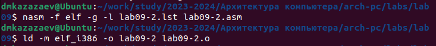{#fig:008 width=70%}

Запускаю файл в обложке GDB. (рис. [-@fig:009])

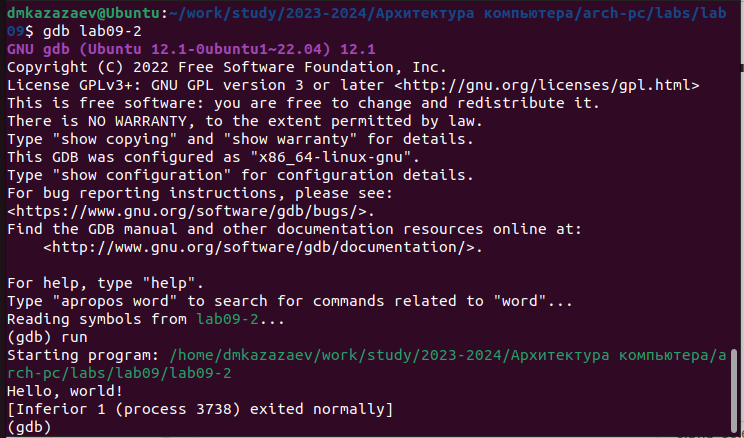{#fig:009 width=70%}

Устанавливаю брейкпоинт на метке _start и запускаю программу. (рис. [-@fig:010])

{#fig:010 width=70%}

Смотрю дисассимилированный код программы начиная с метки _start, после чего переключаюсь на отображение команд с Intel’овским синтаксисом. (рис. [-@fig:011])

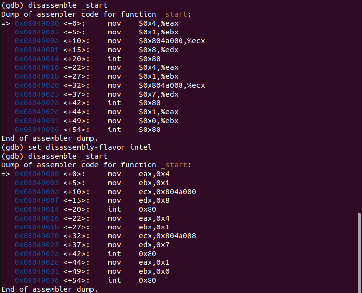{#fig:011 width=70%}

Разница в том, что ATT имена регистров начинаются с символа %, а имена операндов с $, в то время как в Intel используется привычный нам синтаксис.

Включаю режим псевдообработки с помощью комманды ``layout asm```, пишу команду ```layout regs``` и проверяю наличие точки остановы, которая была установлена ранее, после чего ставлю точку остановы по адресу инструкции. (рис. [-@fig:012])

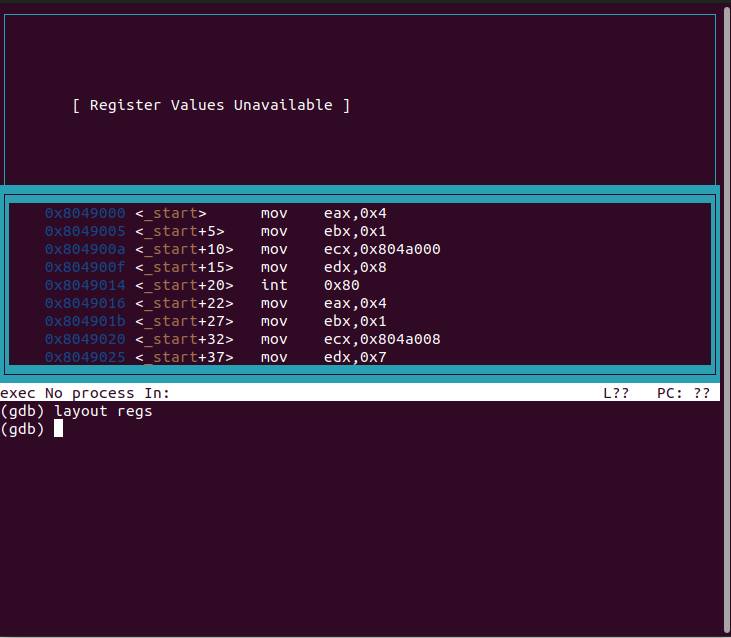{#fig:012 width=70%}

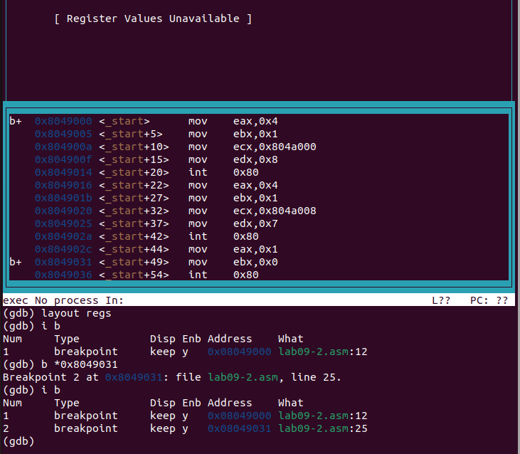{#fig:013 width=70%}

Выполяю пять инструкций с помощью команды ```stepi 5```. (рис. [-@fig:015])

{#fig:014 width=70%}

{#fig:015 width=70%}

Изменились значения регистров eax, ecx, edx и ebx.

Смотрю значение переменной msg1 по имени и меняю первый симфол командой ```set{char}&msg1='h'```.(рис. [-@fig:016])

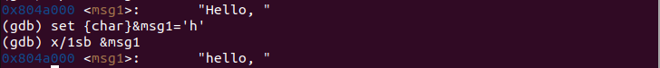{#fig:016 width=70%}

Меняю первый симфол переменной msg2 командой ```set{char}&msg2='W'```. (рис. [-@fig:017])

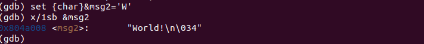{#fig:017 width=70%}

Вывожу в различных форматах значение регистра edx.(рис. [-@fig:018],[-@fig:019],[-@fig:020])

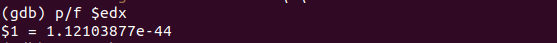{#fig:018 width=70%}

{#fig:019 width=70%}

{#fig:020 width=70%}

**Листинг программы lab9-2.asm**

```
SECTION .data
	msg1: db "Hello, ", 0x0
	msg1Len: equ $ - msg1
	
	msg2: db "world!", 0xa
	msg2Len: equ $ - msg2
	
SECTION .text
	global _start
	
_start:
	mov eax, 4
	mov ebx, 1
	mov ecx, msg1
	mov edx, msg1Len
	int 0x80
	
	mov eax, 4
	mov ebx, 1
	mov ecx, msg2
	mov edx, msg2Len
	int 0x80
	
	mov eax, 1
	mov ebx, 0
	int 0x80
```

Копирую файл lab8-2.asm из прошлой лабораторной работы, назвав его lab9-3.asm. (рис. [-@fig:021])

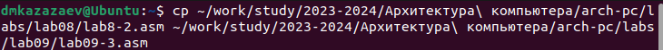{#fig:021 width=70%}

Транислирую файл lab9-3.asm в объектный файл для работы с GDB. (рис. [-@fig:022])

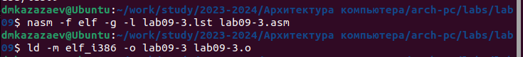{#fig:022 width=70%}

Запускаю файл в обложке GDB. (рис. [-@fig:023])

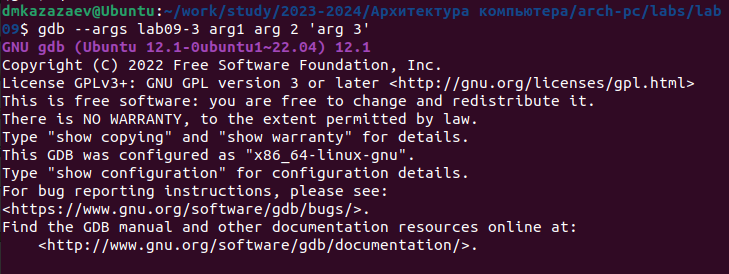{#fig:023 width=70%}

Устанавливаю брейкпоинт на метке _start и запускаю программу указываю аргументы. (рис. [-@fig:024])

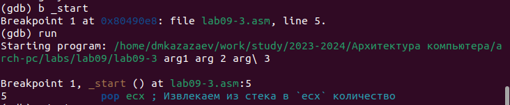{#fig:024 width=70%}

Смотрю позиции стека.(рис. [-@fig:025])

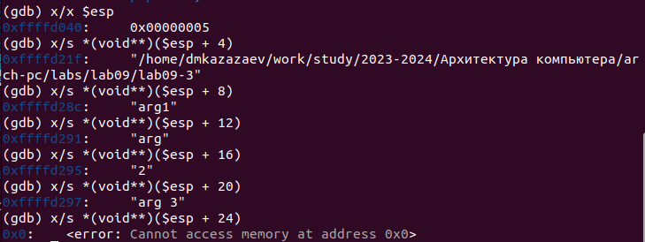{#fig:025 width=70%}

Шаг изменения адреса равен 4, т.к количество аргументов командной строки равно 4.

**Листинг программы lab9-3.asm**

```
%include 'in_out.asm'
SECTION .text
global _start
_start:
	pop ecx ; Извлекаем из стека в `ecx` количество
		; аргументов (первое значение в стеке)
	pop edx ; Извлекаем из стека в `edx` имя программы
		; (второе значение в стеке)
	sub ecx, 1 ; Уменьшаем `ecx` на 1 (количество
		; аргументов без названия программы)
next:
	cmp ecx, 0 ; проверяем, есть ли еще аргументы
	jz _end ; если аргументов нет выходим из цикла
		; (переход на метку `_end`)
		
	pop eax ; иначе извлекаем аргумент из стека
	call sprintLF ; вызываем функцию печати
	loop next ; переход к обработке следующего
		; аргумента (переход на метку `next`)
_end:
	call quit
```

# Выполнение самостоятельной работы

## Задание 1

Копирую task.asm из прошлой лабоаторной. (рис. [-@fig:026])

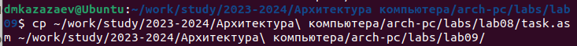{#fig:026 width=70%}

Редактирую файл task.asm добавляя подпрограмму. (рис. [-@fig:027])
	
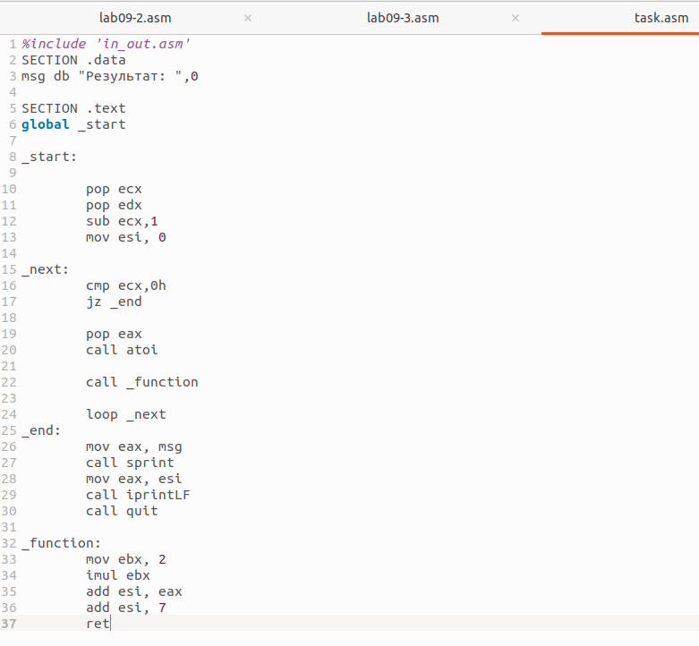{#fig:027 width=70%}

Транислирую файл task.asm в объектный файл, после чего запускаю его. (рис. [-@fig:028])

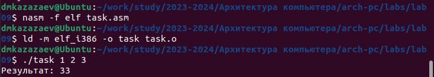{#fig:028 width=70%}

Программа работает корректно.

**Листинг программы task.asm**

```
%include 'in_out.asm'
SECTION .data
msg db "Результат: ",0

SECTION .text
global _start

_start:

	pop ecx 
	pop edx 	
	sub ecx,1 	
	mov esi, 0	
		
_next:
	cmp ecx,0h 	
	jz _end 
		
	pop eax
	call atoi
	
	call _function

	loop _next 	
_end:
	mov eax, msg 	
	call sprint
	mov eax, esi 	
	call iprintLF 	
	call quit 	
	
_function:
	mov ebx, 2
	imul ebx
	add esi, eax
	add esi, 7
	ret
```

## Задание 2

Транислирую файл task2.asm в объектный файл, после чего запускаю его. (рис. [-@fig:029])

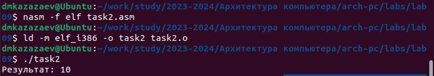{#fig:029 width=70%}

Программа работает некорректно, так как значение, которое она должна вывести должно быть 25.

Запускаю файл в обложке GDB, заранее установив точки останова на инструкциях, в которых происходит математика. (рис. [-@fig:030])

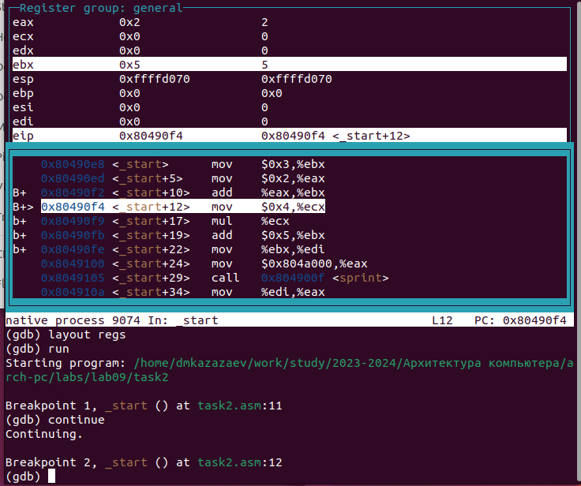{#fig:030 width=70%}

Ищу ошибку, из-за которой программа выводит неправильный ответ. (рис. [-@fig:031])

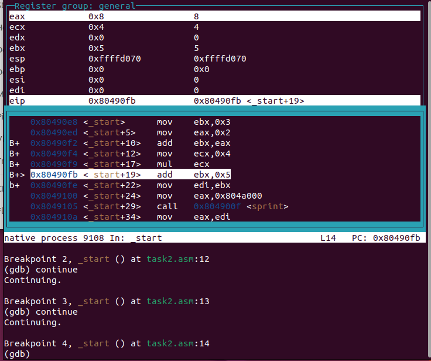{#fig:031 width=70%}

Найдя ошибку, котороая заключалась в том, что в инструкции mul ecx происходит умножение ecx на eаx, то есть 4 на 2, вместо умножения 4 на 5 (регистр ebx), так как инструкция add ebx,eax не связана с mul ecx, но связана инструкция mov eax,2.

Исправляю ошибку.(рис. [-@fig:032])

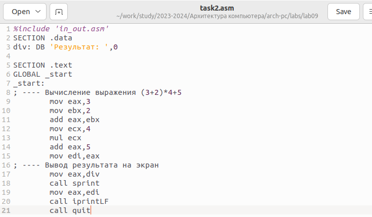{#fig:032 width=70%}

Транислирую файл task.asm в объектный файл, после чего запускаю его. (рис. [-@fig:033)

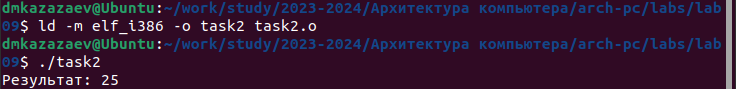{#fig:033 width=70%}

Успех

**Листинг task2.asm**

```
%include 'in_out.asm'
SECTION .data
div: DB 'Результат: ',0

SECTION .text
GLOBAL _start
_start:
; ---- Вычисление выражения (3+2)*4+5
	mov eax,3
	mov ebx,2
	add eax,ebx
	mov ecx,4
	mul ecx
	add eax,5
	mov edi,eax
; ---- Вывод результата на экран
	mov eax,div
	call sprint
	mov eax,edi
	call iprintLF
	call quit	
```

#Вывод

При выполнении лабораторной работы я приобрел навыки написания программ с использованием подпрограмм и ознакомился с методами отладки при помощи GDB и его основными возможностями.

