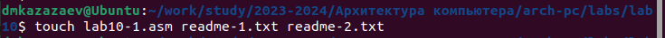
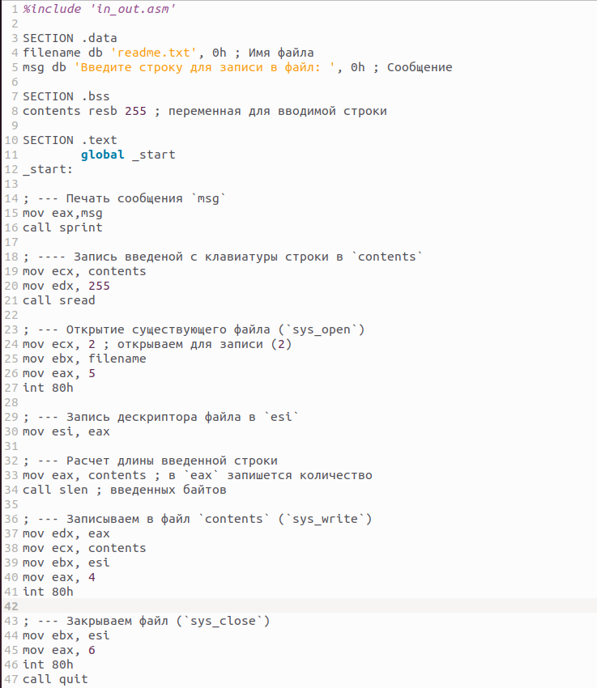
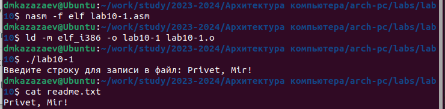
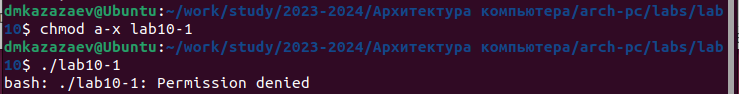
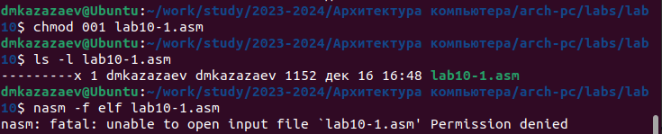
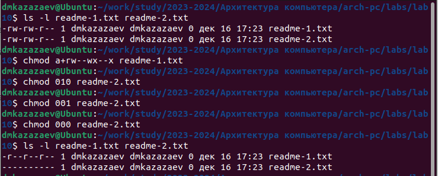
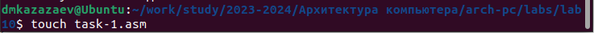
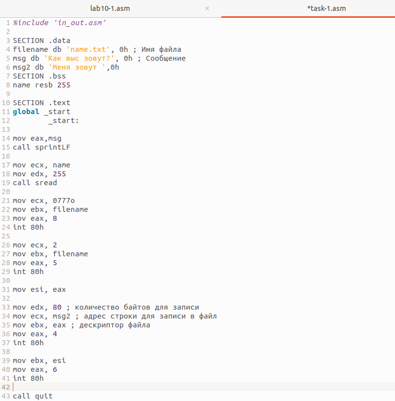
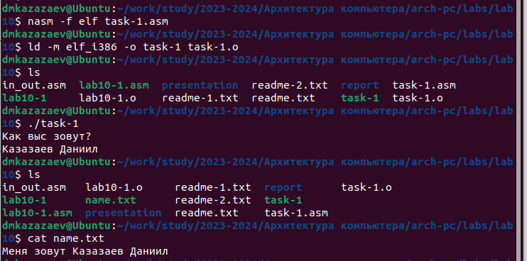

---
## Front matter
title: "Отчет по лабораторной работе № 10"
subtitle: "Дисциплина: архитектура компьютеров"
author: "Казазаев Даниил Михайлович"

## Generic otions
lang: ru-RU
toc-title: "Содержание"

## Bibliography
bibliography: bib/cite.bib
csl: pandoc/csl/gost-r-7-0-5-2008-numeric.csl

## Pdf output format
toc: true # Table of contents
toc-depth: 2
lof: true # List of figures
lot: false # List of tables
fontsize: 12pt
linestretch: 1.5
papersize: a4
documentclass: scrreprt
## I18n polyglossia
polyglossia-lang:
  name: russian
  options:
	- spelling=modern
	- babelshorthands=true
polyglossia-otherlangs:
  name: english
## I18n babel
babel-lang: russian
babel-otherlangs: english
## Fonts
mainfont: PT Serif
romanfont: PT Serif
sansfont: PT Sans
monofont: PT Mono
mainfontoptions: Ligatures=TeX
romanfontoptions: Ligatures=TeX
sansfontoptions: Ligatures=TeX,Scale=MatchLowercase
monofontoptions: Scale=MatchLowercase,Scale=0.9
## Biblatex
biblatex: true
biblio-style: "gost-numeric"
biblatexoptions:
  - parentracker=true
  - backend=biber
  - hyperref=auto
  - language=auto
  - autolang=other*
  - citestyle=gost-numeric
## Pandoc-crossref LaTeX customization
figureTitle: "Рис."
tableTitle: "Таблица"
listingTitle: "Листинг"
lofTitle: "Список иллюстраций"
lotTitle: "Список таблиц"
lolTitle: "Листинги"
## Misc options
indent: true
header-includes:
  - \usepackage{indentfirst}
  - \usepackage{float} # keep figures where there are in the text
  - \floatplacement{figure}{H} # keep figures where there are in the text
---

# Цель работы

Целью работы является приобретение навыков написания программ для работы с файлами.

# Задания Лабораторной работы

1. Создать файл lab10-1.asm,readme-1.txt,readme-2.txt.
2. Перенести листинг 10.1 в файл lab10-1.asm, после чего создать исполняемый файл и проверить его работу.
3. С помощью команды ```chmod``` запретить доступ к файлу lab10-1 и попытаться выпонить файл.
4. С помощью команды ```chmod``` запретить доступ к файлу lab10-1.asm и попытаться выполгнить его.
5. В соответствии с вариантом в таблице 10.4 предоставить права доступа к файлу readme1.txt представленные в символьном виде, а для файла readme-2.txt – в двочном виде.
Проверить правильность выполнения с помощью команды ```ls -l```.


# Задания Самостоятельной работы

1. Соозлать программу, которая работает по алгоритму из лабораторной работы.


# Выполнение лабораторной работы

Создаю файлы lab10-1.asm,readme-1.txt,readme-2.txt. (рис. [-@fig:001])

{#fig:001 width=70%}

Ввожу в файл lab10-1.asm текст программы из листинга 10.1. (рис. [-@fig:002])

{#fig:002 width=70%}

Проверяю, отработала ли программа коректно с помощью команды ```cat readme.txt```. (рис. [-@fig:003])

{#fig:003 width=70%}

Программа работает коректно.

С помощью команды ```chmod``` запрещаю доступ к файлу lab10-1, после чего пытаюсь выпонить файл. (рис. [-@fig 004])

{#fig:004 width=70%}

Так как я запретил доступ для всех, я не могу выполнить файл, так как у меня нет доступа к файлу.

С помощью команды ```chmod``` разрешаю доступ к исполнению файла lab10-1.asm, после чего пытаюсь выпонить файл. (рис. [-@fig:005])

{#fig:005 width=70%}

Так как у меня восьмой вариант выполняю эти наборы прав доступа: rw- -wx --x, 010 001 000; для файлов readme-1.txt и readme-2.txt. (рис. [-@fig:006])

{#fig:006 width=70%}

# Выполнение самостоятельной работы

Создаю task-1.asm для выполнения задания. (рис. [-@fig:007])

{#fig:007 width=70%}

Пишу програму соответствующую заданию из самостоятельной рабоы. (рис. [-@fig:008])
	
{#fig:008 width=70%}

Транислирую файл lab10-1.asm в объектный файл, после чего запускаю его. После запуска проверяю выполнение программы. (рис. [-@fig:009])

{#fig:009 width=70%}

Программа работает корректно.

**Листинг программы task-1.asm**

```
%include 'in_out.asm'

SECTION .data
filename db 'name.txt', 0h
msg db 'Как выс зовут?', 0h
msg2 db 'Меня зовут ',0h
SECTION .bss
name resb 255

SECTION .text
global _start
	_start:
	
mov eax,msg
call sprintLF

mov ecx, name
mov edx, 255
call sread

mov ecx, 0777o
mov ebx, filename 
mov eax, 8 
int 80h 

mov ecx, 2
mov ebx, filename
mov eax, 5
int 80h

mov esi, eax

mov edx, 80 ; количество байтов для записи
mov ecx, msg2 ; адрес строки для записи в файл
mov ebx, eax ; дескриптор файла
mov eax, 4
int 80h 

mov ebx, esi
mov eax, 6
int 80h

call quit
```

#Вывод

При выполнении лабораторной работы я приобрел навыки написания программ для работы с файлами.

